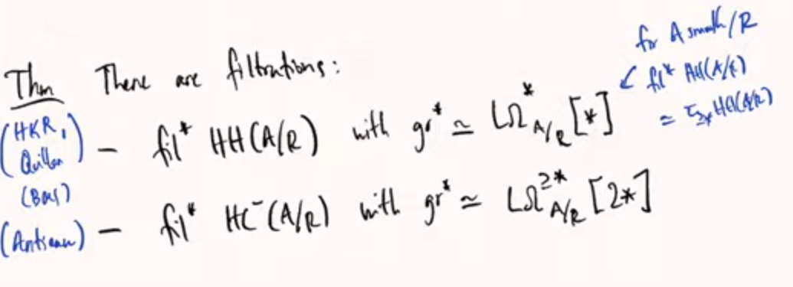

# 2021-05-06

## 11:15

> Reference: Arpon Raksit - Hochschild homology and the derived de Rham complex revisited. <https://www.youtube.com/watch?v=E84gVDm1kvM>

- [[Algebraic de Rham complex]]:

- Can get a derived version: take *non-abelian derived functors*, i.e. take a [[simplicial resolution]] by simplicial polynomial algebras and apply the functor to the resolution.
  - Equivalently a [[left Kan extension]]?
- Define $\Ld \Omega^1 _{A/R}$ to be the [[cotangent complex]] and take derived exterior powers for the other degrees.
- Derived [[Hodge filtration]] may not be complete, so take completion: take cone (cofiber?) in derived category and take a hocolim.

- Fact: de Rham complex has a universal property, initial (strictly, so odd elements square to zero) commutative [[DGA]] receiving a map $A\to X^0$, so the initial way to turn an algebra into a DGA.
  Does the derived version have a similar property?

- $\HH(A/R) \da A^{\tensor_R S^1}$ the $S^1$ tensoring, take homotopy fixed points to get $\HC^-$.
- Associated graded of $\HH$ recovers derived de Rham:

  - Why does this happen? $\HH(A/R)$ is the initial [[simplicial algebra | simplicial $R\dash$algebra]] with an $S^1\dash$action receiving a map from $A$.
  - Analogies
    - Simplicial ring $\mapstofrom$ [[CDGAs]]
    - $S^1$ action $\mapstofrom$ the differential

- Can take homotopy groups of $\HH$????

## 13:11

> Reference: Andrew Blumberg, Floer homotopy theory and Morava K-theory. 
  Princeton Algebraic Topology Seminar

- Some relevant things about [[Morava K-theory]]:

- Produce a virtual fundamental class for flow categories.
  Moduli spaces of trajectories appearing will be "derived orbifolds".

- Flow category:

  - Enriched in spaces

- Where do flow categories come from?
  One natural source: Morse functions.
  Objects are critical points, morphisms are roughly trajectories.

- Given a functor $\cat{C} \to \Sp$ out of a flow category, can construct a spectrum as a $\hocolim$.
  Turns Floer data into stable homotopy data?

-

