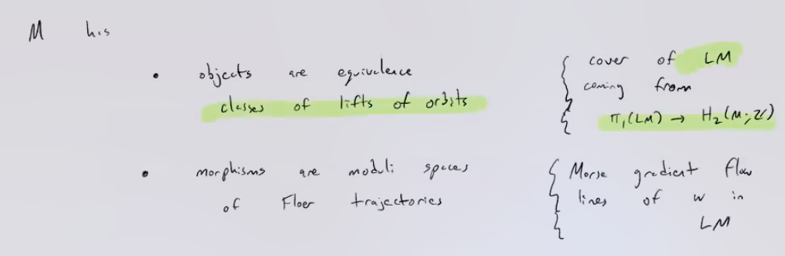
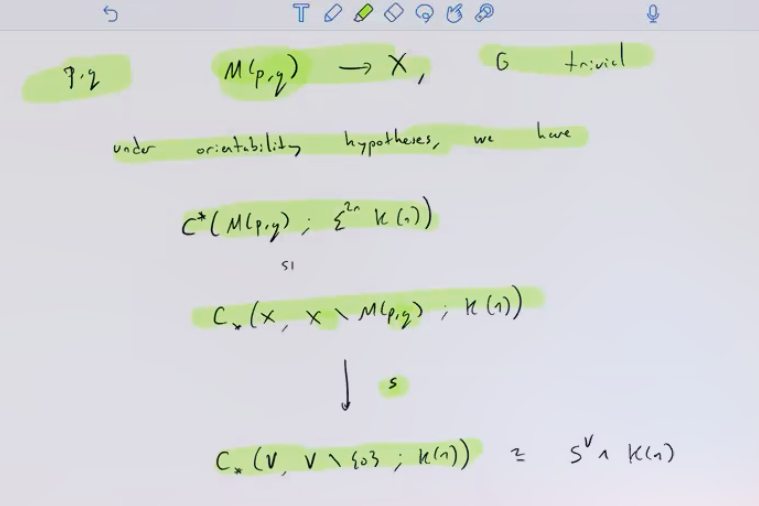
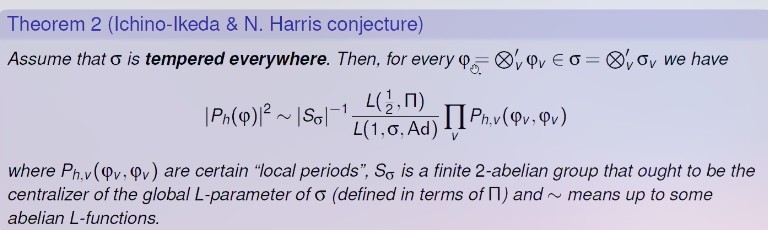

# 2021-05-06

## 11:15

> Reference: Arpon Raksit - Hochschild homology and the derived de Rham complex revisited. <https://www.youtube.com/watch?v=E84gVDm1kvM>

- [[Algebraic de Rham complex]]:

- Can get a derived version: take *non-abelian derived functors*, i.e. take a [[simplicial resolution]] by simplicial polynomial algebras and apply the functor to the resolution.
  - Equivalently a [[left Kan extension]]?
- Define $\Ld \Omega^1 _{A/R}$ to be the [[cotangent complex]] and take derived exterior powers for the other degrees.
- Derived [[Hodge filtration]] may not be complete, so take completion: take cone (cofiber?) in derived category and take a hocolim.

- Fact: de Rham complex has a universal property, initial (strictly, so odd elements square to zero) commutative [[DGA]] receiving a map $A\to X^0$, so the initial way to turn an algebra into a DGA.
  Does the derived version have a similar property?

- $\HH(A/R) \da A^{\tensor_R S^1}$ the $S^1$ tensoring, take homotopy fixed points to get $\HC^-$.
- Associated graded of $\HH$ recovers derived de Rham:

  - Why does this happen? $\HH(A/R)$ is the initial [[simplicial algebra | simplicial $R\dash$algebra]] with an $S^1\dash$action receiving a map from $A$.
  - Analogies
    - Simplicial ring $\mapstofrom$ [[CDGAs]]
    - $S^1$ action $\mapstofrom$ the differential

- Can take homotopy groups of $\HH$????

## 13:11

> Reference: Andrew Blumberg, Floer homotopy theory and Morava K-theory. 
  Princeton Algebraic Topology Seminar

- Topic: [[Floer homotopy theory]]

- Some relevant things about [[Morava K-theory]], which will be coefficients that we take

- Produce a virtual fundamental class for flow categories.
  Moduli spaces of trajectories appearing will be "derived [[orbifolds]]".

  - Use some derived/spectral version of the usual [[Novikov ring]]?

- Flow category:

  - Enriched in spaces
  - Use a so-called *Kuranishi flow category*.
  - Use [[ambidexterity]], some kind of Poincaré duality for orbifolds
  - Uses [[norm map]]

- Where do flow categories come from?
  One natural source: Morse functions.
  Objects are critical points, morphisms are roughly trajectories.

- Given a functor $\cat{C} \to \Sp$ out of a flow category, can construct a spectrum as a $\hocolim$.
  Turns Floer data into stable homotopy data?

- Defining a flow category:

  - Morphisms are moduli spaces of Floer trajectories, i.e. flow lines using the symplectic form?

  - Action map $A: P\to \RR$ given by integration, objects of $P$ form a poset.

  - Action induces a filtration $P_{ \lambda} \da \ts{ p\in P \st A(p) < \lambda}$.

  - Get filtered modules, need to work with a completion of this filtration.
    Tough to build/describe, uses point-set language and zigzags.
    Maybe easier in infty-categorical language?

- Get an $E_2$ ring spectrum -- not great! 
  But there is an Ore condition that makes things nicer.

- Can express enrichments in terms of [[lax functors]] from an indexing 2-category
  - Cats of objects of set type $S$ and morphism type $V$ are lax functors from some indiscrete indexing 2-category (associated to $S$?) to a [[bicategory]] associated to $V$.
  - Lax functors of bicategories: yikes.
  - A lot of [[homotopy coherence]] problems to deal with.

- How does one construct the [[virtual fundamental class]]?
  Under orientability hypothesis, have some kind of [[Alexander duality]].

- See the [[Borel construction]], the [[Adams isomorphism]], [[ambidexterity]].
  - Orientability hypothesis allows using the [[Thom isomorphism]] on [[equivariant cobordism]].
    See [[complex stability]].
  - Uses some model of iterated cones, similar to Khovanov stuff?

- Cover moduli space by Kuranishi charts $(X, G, s, Y)$
  - Symmetric monoidal structure is basically component-wise.
  - Morphisms are complicated, essentially involves transversality conditions (free actions, topological submersions, etc).
  - Stronger requirements than what John Pardon (?) imposes in his work on [[virtual fundamental classes]].

- Technical issues with loop actions on categories, only get module structure on homotopy category?
  - Also issues with local-to-global coherence, need $\hocolim$ to be compatible with Kuranishi atlases?
    And technical tools like [[Adams isomorphism]] and [[norm map]].
    Need lots of [[equivariant stable homotopy theory]].
  - Substantial difficulties extracting this data from the symplectic structure.
    - "This data": stratified oriented Kuranishi structures?
  - Build a spectrum with some [[bar construction]]

- Can get the [[Arnold conjecture]] from this homotopy type!
  I.e. $\rank \HF_*(H, \Lambda) \leq \#\text{ orbits}$, here we're taking homotopy groups.
  $H$ is a [[Hamiltonian]].
  - Can split $H_*(M; \Lambda)$ off from $\HF_*(H; \Lambda)$.

  - Recover statement about $\HF_p$ cohomology using the [[AHSS]].

- Technical problems: virtual cochains are not functorial in morphisms of Kuranishi charts.
  No canonical map between certain cofibers.
  There are maps, they require choices, tracking them is tough.

  - Solution: degenerate to the [[normal cone]] to produce [[zigzags]].

  - Sits between two Kuranishi charts by looking at the ends of the cone.

- A lot of cool stuff for homotopy theorists to do here!
  - See Cohen-Jones-Segal.
  - Homotopy theory should yield interesting symplectic consequences.
  - Work to build spectrally enriched [[Fukaya categories]].
  - Should be doing global homotopy theory or global homology, yielding a nicer way to describe all of this.
    Rezk is a proponent!

  - Can one do this over other spectra?
  Need strong orientability conditions.
  Don't expect a lift to the sphere spectrum, but maybe $\ku, \mu$.

- Improvement over rational results when there is torsion.
  May not improve over numerical bounds for special classes of symplectic manifolds.

- [[Morava K theory]] is useful here because it behaves well with respect to finite groups
  - Want to dualize classifying spaces of orbifolds, use Poincaré duality for orbifolds.
    Equivariant stuff appears as an alternative to going to $H_*(X; \QQ)$.
- Comment by Morava: the $p=2$ case may be resolvable, see Boardman's last paper.
  Set up some category of modules over the $p=2$ [[Bockstein]].

## 14:05

> Reference: Raphaël Beuzart-Plessis, On the spectral decomposition of the Jacquet-Rallis trace formula and the Gan-Gross-Prasad conjecture for unitary groups.
  BC NT/AG Seminar.

- Look at [cuspidal]] [[automorphic representations]] to $\PGL_2(\FF)$ for $\FF$ a [[number field]].

- This talk: generalizing some of these formulas:

  - See [[split torus]], [[quaternion algebra]].

- See [[cusp forms]], [[periods]], [[trace formulas]]

- Gan-Gross-Prasad and Ichino-Ikeda conjecture for unitary groups
  - $E/\FF$ a quadratic extension of number fields, so $\Gal(E/\FF) \cong \ZZ/2 = \ts{ 1, c }$.
  - Take a nondegenerate [[Hermitian form]] $h$ on $E^n$, define $U(h)$ as the [[unitary group]] of $h$ and set $U_h \da U(h) \cross U(h \oplus h_0)$ and $h_0: E^2 \to E$ where $(x,y) \mapsto xy^c$.
  - Define an [[L function]]:

  

- Theorem: from [[Langlands]] philosophy.
  There is a [[Hermitian form]] and a [[cuspidal representation]] in the same [[L packet]] where $P$ is nonvanishing.
- Theorem/conjecture: if $\sigma$ is [[tempered]] everywhere, there is a formula:

  

  - See [[special values of L functions]].

- Proved in special cases.
- Recent result: $P_h\neq - \implies L(1/2, \Pi)\neq 0$ proved using twisted automorphic descent.
- See [[regularization]], [[Langlands decomposition]], [[Eisenstein series]], [[Levi]], [[GIT quotients]], [[orbital integrals]]

  

- Global [[distributions]] break into an [[Euler product]] of local distributions.
  
- Part of proof: use [[zeta integrals]] of [[kernel functions]], fix one variable to get a function in a [[Schwartz space]].
  - See [[unipotent]] subgroups
