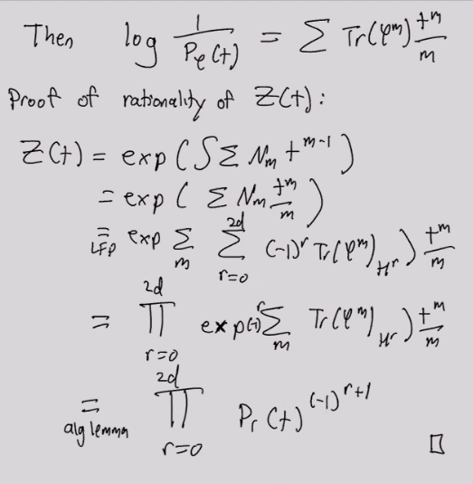

# 2021-05-10

## 12:34

We haven't been able to classifying the rational points on modular curves!

## 13:16

> Reference: Kirsten Wickelgren, 

- Dualizability?

\begin{tikzcd}
	R && {V\tensor V\dual} && {V\tensor V\dual} && R \\
	1 && {\sum e_i \tensor e_i\dual} && {v\tensor \alpha} && {\alpha(v)}
	\arrow[from=1-1, to=1-3]
	\arrow["{\phi\tensor 1}", from=1-3, to=1-5]
	\arrow["\ev", from=1-5, to=1-7]
	\arrow[from=2-1, to=2-3]
	\arrow[from=2-3, to=2-5]
	\arrow[from=2-5, to=2-7]
\end{tikzcd}

> [Link to Diagram](https://q.uiver.app/?q=WzAsOCxbMCwwLCJSIl0sWzIsMCwiVlxcdGVuc29yIFZcXGR1YWwiXSxbNCwwLCJWXFx0ZW5zb3IgVlxcZHVhbCJdLFs2LDAsIlIiXSxbMCwxLCIxIl0sWzIsMSwiXFxzdW0gZV9pIFxcdGVuc29yIGVfaVxcZHVhbCJdLFs0LDEsInZcXHRlbnNvciBcXGFscGhhIl0sWzYsMSwiXFxhbHBoYSh2KSJdLFswLDFdLFsxLDIsIlxccGhpXFx0ZW5zb3IgMSJdLFsyLDMsIlxcZXYiXSxbNCw1XSxbNSw2XSxbNiw3XV0=)

- Works in a symmetric monoidal category.
- Finite dimensionality is replaced by objects being [[dualizable]], so for
\[
\one & \mapsvia{m} A\tensor B \\
B\tensor A & \mapsvia{\eps} \one
,\]
require

\begin{tikzcd}
	A && {A\tensor B \tensor A} && A \\
	\\
	B && {B\tensor A \tensor B} && B
	\arrow["{m\tensor 1}", from=1-1, to=1-3]
	\arrow["{1\tensor \eps}", from=1-3, to=1-5]
	\arrow["\id"', curve={height=-30pt}, from=1-1, to=1-5]
	\arrow["{1\tensor m}"', from=3-1, to=3-3]
	\arrow["{\eps \tensor 1}"', from=3-3, to=3-5]
	\arrow[curve={height=30pt}, from=3-1, to=3-5]
\end{tikzcd}

> [Link to Diagram](https://q.uiver.app/?q=WzAsNixbMCwwLCJBIl0sWzIsMCwiQVxcdGVuc29yIEIgXFx0ZW5zb3IgQSJdLFs0LDAsIkEiXSxbMCwyLCJCIl0sWzIsMiwiQlxcdGVuc29yIEEgXFx0ZW5zb3IgQiJdLFs0LDIsIkIiXSxbMCwxLCJtXFx0ZW5zb3IgMSJdLFsxLDIsIjFcXHRlbnNvciBcXGVwcyJdLFswLDIsIlxcaWQiLDIseyJjdXJ2ZSI6LTV9XSxbMyw0LCIxXFx0ZW5zb3IgbSIsMl0sWzQsNSwiXFxlcHMgXFx0ZW5zb3IgMSIsMl0sWzMsNSwiIiwwLHsiY3VydmUiOjV9XV0=)

- See Atiyah duality: define the dual of $M$ as $M^{-\T M}$, the Thoma space of (minus) the tangent bundle.

- Define the trace:

\begin{tikzcd}
	1 && {A\tensor \DD A} && {A\tensor \DD A} && {\DD A \tensor A} && 1
	\arrow["\eps", from=1-7, to=1-9]
	\arrow["{\tau \quad \sim}", from=1-5, to=1-7]
	\arrow["{\phi \tensor 1}", from=1-3, to=1-5]
	\arrow["m", from=1-1, to=1-3]
	\arrow["{\Tr(\phi)}"', curve={height=30pt}, from=1-1, to=1-9]
\end{tikzcd}

> [Link to Diagram](https://q.uiver.app/?q=WzAsNSxbMCwwLCIxIl0sWzIsMCwiQVxcdGVuc29yIFxcREQgQSJdLFs0LDAsIkFcXHRlbnNvciBcXEREIEEiXSxbNiwwLCJcXEREIEEgXFx0ZW5zb3IgQSJdLFs4LDAsIjEiXSxbMyw0LCJcXGVwcyJdLFsyLDMsIlxcdGF1IFxccXVhZCBcXHNpbSJdLFsxLDIsIlxccGhpIFxcdGVuc29yIDEiXSxbMCwxLCJtIl0sWzAsNCwiXFxUcihcXHBoaSkiLDIseyJjdXJ2ZSI6NX1dXQ==)

- Then $\Tr(\phi) \in \Endo_{\cat C}(\one, \one)$ is an endomorphism of the unit.

- Example: Lefschetz fixed point theorem,
\[
\Tr(\phi) = \sum_{x\in M, \phi(x) = x} \ind_x \phi \in \Endo_{\ho\Sp}(\one) \mapsvia{\deg \,\, \sim} \ZZ
,\]
  where we take the degree of a map between spheres.
  
  - $\SS = \one \in \ho\Sp$.

  - Use that $H^*(\wait, \QQ)$ preserves tensor products, and apply the Kunneth formula:
\[
H^*(\Tr(\phi)) &= \Tr(H^*(\phi)) \\
\implies 
\sum (-1)^i \Tr( H^i(\phi); H^i(M) \selfmap )
&= \sum_{x\in M, \phi(x) = x} \ind_x \varphi
.\]

- Rationality of $\zeta$:

- Use hocolims to glue spaces, but may not work in schemes.

  - Example: take $X \da \PP^n/\PP^{n-1}$, then we'd want $X(\CC) \cong S^{2n}$ and $X(\RR) \cong S^n$
  - Problem: this quotient isn't a scheme.
  Can freely add these limits.

