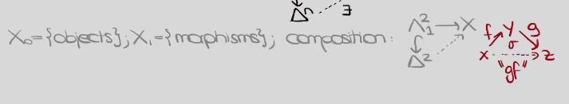

# 2021-06-05

## 12:08

- $(\infty, 2)$ category: discrete set of objects, enriched in categories, $2\dash$morphisms are strictly associative?
- $(\infty, n)$ categories: all $n+k\dash$morphisms are invertible.
- There is an embedding $n\Cat$ into $(\infty, n)\dash\Cat$with a specific model structure.
- Model structure on $\sSet$: fibrant objects are Kan complexes, there is a Quillen equivalence between $\Top$ and $\sSet$
- $\inftycat{\infty, 1}$: enriched in $\inftygpd$
  - Quasicategory: lifting property with lifting against inner horns online

  

  - Joyal model structure: $\sSet$ with quasicategories as fibrant objects.
  - Quillen equivalence to the Kan model structure by taking the homotopy coherent nerve?

- Fact: nerve is a Kan complex iff $\cat{C}$ is a groupoid.
- Complete Segal space: a simplicial space $W \Delta\op\to \sSet_{\Kan}$ with some conditions
- $\sSet^{\Delta\op}$ has a model structure where complete Segal spaces are the fibrant objects

- Fact: if $W$ is a complete Segal space then $i_1^* W$ is a quasicategory where $i_1: \Delta \to \Delta^{\times 2}$ sends $[n]$ to $([n], [0])$.
