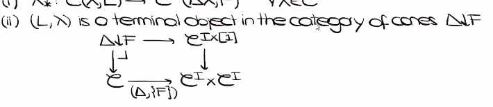
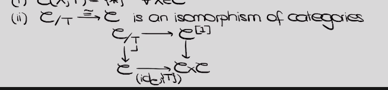

# 2021-06-05

## 12:08

- $\inftycat{\infty, 2}$: discrete set of objects, enriched in categories, $2\dash$morphisms are strictly associative?
- $\inftycat{\infty, n}$: all $n+k\dash$morphisms are invertible.
- There is an embedding $n\Cat$ into $(\infty, n)\dash\Cat$with a specific model structure.
- Model structure on $\sSet$: fibrant objects are Kan complexes, there is a Quillen equivalence between $\Top$ and $\sSet$
- $\inftycat{\infty, 1}$: enriched in $\inftygpd$
  - Quasicategory: lifting property with lifting against inner horns online

  

  - Joyal model structure: $\sSet$ with quasicategories as fibrant objects.
  - Quillen equivalence to the Kan model structure by taking the homotopy coherent nerve?

- **Exercise**: nerve is a Kan complex iff $\cat{C}$ is a groupoid.
- Complete Segal space: a simplicial space $W \Delta\op\to \sSet_{\Kan}$ with some conditions
- $\sSet^{\Delta\op}$ has a model structure where complete Segal spaces are the fibrant objects

- **Exercise**: if $W$ is a complete Segal space then $i_1^* W$ is a quasicategory where $i_1: \Delta \to \Delta^{\times 2}$ sends $[n]$ to $([n], [0])$.

- Limits: isomorphisms on hom sets, or terminal objects in the category of cones:
  
  

  - Latter is more universal, only requires pullbacks and cotensors to define?

- Terminal objects: isomorphisms from slice cats to $\cat{C}$:

  

- Enriched definition of limits:

  

- Terminal objects: $X\slice{x} \mapsvia{\sim} X$ is a weak equivalence in $\sSet_{\qcat}$.

- All definitions of limits in $\inftycat{\infty, 1}$ recover the usual notions via the nerve.

- **Exercise**: Show that the limit ot $F: I\to \cat{C}$ is the limit of its nerve?

- Theorem: limit of $F$ in $\sSet_{\qcat}$ is a homotopy limit of its adjoint in $\sSet\dash\Cat_{\Kan}$, and the limit of its adjoint in $\sSet^{\Delta\op}_\CSS$.
