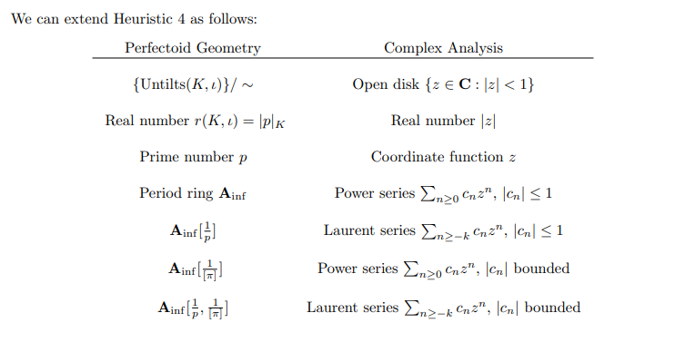

# 2021-07-01

## 23:37

Some notes on the Fargues-Fontaine curve.

### Definitions

- *Curve*: over $k=\kbar$, an integral separated scheme of finite type over $k$ of dimension 1.
- *Algebraic curve*: pure Krull dimension 1, or equivalently has an affine open cover where $\spec R_i$ is Krull dimension 1.
  - For (irreducible) varieties over $k=\kbar$, just an algebraic variety of dimension 1.
- *Complete curve*: for algebraic varieties $X$, universally closed: the projections $X\cross (\wait)\to(\wait)$ are closed maps when evaluated on any variety.
  Equivalently, $X\to k$ is a proper morphism (separated, finite type, and universally closed)
  - For topological spaces, $X$ is compact iff $X$ is complete.
  - Complete (smooth) varieties of dimension 1 are always projective.
- *Completely valued field*: a field $k$ equipped with a valuation $v:K \to \RR_{\geq 0}$ which is complete as a metric space with respect to $v$.
- *Valuation ring*: defined as $\OO_K \da \ts{x\in K \st v(x) \leq 1}$, the unit disc with respect to the valuation.
  - Has a unique maximal ideal, the interior of the disc: $\mfm \da \OO_K\sm ts{v(x) = 1}$.
- *Dedekind scheme*: a Noetherian integral scheme of dimension 1 where every local ring is regular.
  - Example: $\spec R$ for $R$ a Dedekind domain.
  - Slogan: any non-generic point is a closed point.
- *Tilts*: for $k$ a field, denoted $k^\tilt \da \inverselim (k\mapsvia{x\mapsto x^p} k \mapsvia{x\mapsto x^p} k \cdots)$, realized as certain sequences, made into a characteristic $p$ field with pointwise multiplication and a $p\dash$twisted addition law involving limits.
  Equipped with a valuation and a valuation ring.
- *Untilts*: For $k$ a field, a pair $(K, \iota)$ where $\iota: k\mapsvia{\sim} K^\tilt$ is an isomorphism of fields, plus a condition on valuation rings $\OO_k$ and $\OO_K^\tilt$.

### Main Results

- Why care about tilts/untilts: for $k$ a field and $X\da \spec \QQ$ as a scheme, characteristic zero tilts of $k$ are a good replacement for $X(k)$ which makes $X\cross X$ nontrivial.

- Main theorem: if $k = \kbar$ is a completely valued characteristic $p$ field, then there exists a Dedekind scheme $X \to \spec \QQpadic$ whose closed points $x$ (or rather their local rings $\OO_{X, x}$) yield (isomorphism classes) of characteristic 0 untilts of $k$, modulo the action of the Frobenius $\phi(x) = x^p$.
  - So moduli of untilts of a perfectoid field, behaves like open disc in $\CC$.
  The unique characteristic $p$ untilt is like $z=0 \in \CC$.

- Why the FF "curve" isn't a curve: it's a scheme over $\QQpadic$, but not finite-type: specifically, the structure morphism $X\to \spec \QQpadic$ is not finite type (on affines: $\spec A\to \spec B$ induces $B\to A$ making $A \in \modsleft{B}$ finitely generated).
  -Why not finite type? Since if $x\in X$ is a closed point then the residue field $\kappa(x) / \QQpadic$ is not a finite extension.
  - Incidentally, $\kappa(x)$ is exactly the untilt of $k$ corresponding to $x$.

- Nice properties of $X_{\ff}$ coinciding with curves:
  - $\sum \deg_x(f) = 0$ for every rational function $f$ on $X_{\ff}$, similar to being projective/complete
  - Line bundles are classified by degree
  - $H^1(C, \OO_C) = 0$, similar to having genus $g=0$
  - $X\to \spec \QQpadic$ has simply connected fibers
- Local Langlands for $\QQpadic$ should be encoded as geometric Langlands on $X_{\ff}$.

- Suppose to geometrize period rings from $p\dash$adic Hodge theory.

- Useful heuristics:

Constructing the curve:

### Method 1: Analytically

- Punchline: $X_{\ff} = \Proj\qty{\bigoplus_{n\geq 0} B^{\phi = p^n}}$ as a scheme.

- $B^{\phi = p^n}$ are the elements in $B$ where $\phi(x) = p^n x$ where $\phi$ is the Frobenius.
- $B \da \colim_{I\subseteq [0, 1] \subset \RR} B_{I}$ is a $p\dash$adic Frechet space
  - Supposed to look like holomorphic functions of $p$.

- For $I\da [a, b]$, $B_{[a, b]}$ is the completion of $W(\OO_C^\tilt)\adjoin{{1\over p}, {1\over \abs \pi }}$ with respect to Gauss norms, where $W$ denotes the Witt vectors, and we've localized at $p$ and a pseudo-uniformizer.

### Method 2: Informal

Glue an affine scheme to a formal disk along a formal punctured disc
\[
X_\ff = \Spec B_\cris^{\phi = 1} \glue_{\Spec B_\dR} \Spec B_\dR^+
.\]

