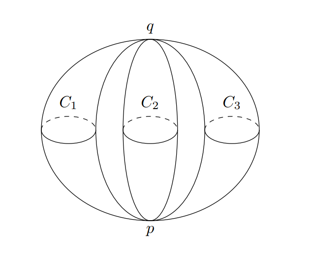

Topics: [Algebraic Geometry](Subjects/Algebraic%20Geometry.md) | [Physics](Physics.md) | [Complex Algebraic Geometry](Complex%20Algebraic%20Geometry)

- Definition: ?

- Another from [Berger's classification](Holonomy%20Classification.md), special case of [Kähler Manifolds](Kähler%20Manifold)

- Setting for [Mirror Symmetry](Mirror%20Symmetry.md): the symplectic geometry of a Calabi-Yau is "the same" as the complex geometry of its mirror.

- Applications: Physicists want to study $G_2$ manifolds (an exceptional Lie group, automorphisms of octonions), part of $M\dash$theory uniting several [superstring theories](Superstring%20theory.md), but no smooth or complex structures. 
  - Indirect approach: compactify an 11-dimension space, one small $S^1$ dimension to 10 dimensions, 
    - 4 from a spacetime and 6 from a "small" Calabi-Yau

	

- As manifolds: 

  - Yau, Fields Medal 1982: There are [Ricci flat](Ricci%20curvature.md) but non-flat (nontrivial holonomy) projective complex manifolds of dimensions $\geq 2$.

- As varieties: the [canonical bundle](canonical%20bundle.md) $\Lambda^n T\dual V$ is trivial

- Compact classification for $\CC\dash$dimension:
  - Dimension 1: 1 type, all elliptic curves (up to homeomorphism)
  - Dimension 2: 1 type, [$K3$ surfaces](K3%20Surface)
  - Dimension 3: (threefolds) conjectured to be a bounded number, but unknown.
    At least 473,800,776!

