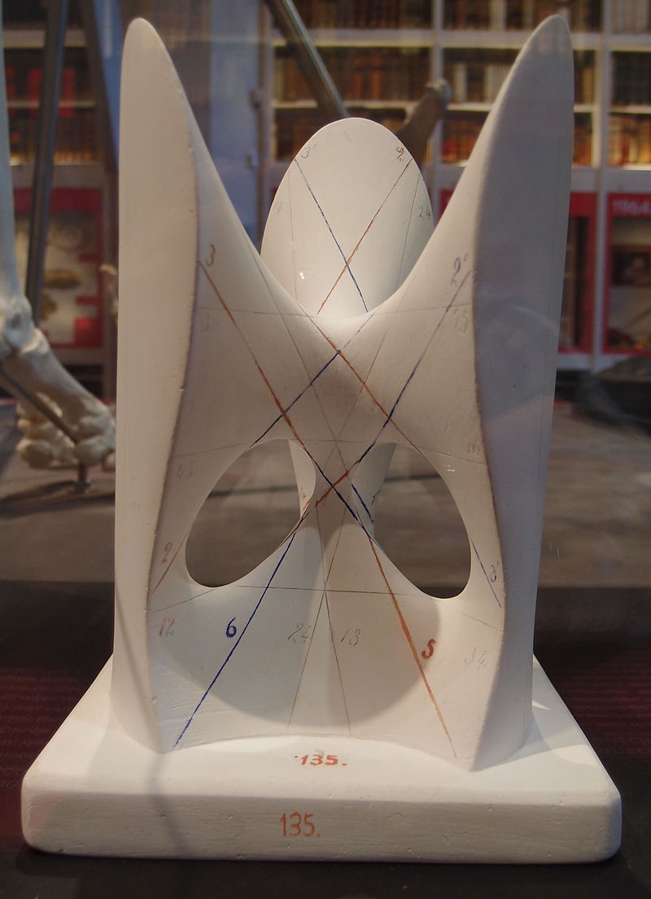

> Work over $\CC$ for simplicity, take all dimensions over $\CC$.

- Minimal model program: classifying complex projective varieties.

- Stratify the "moduli space" of varieties by $\kk\dash$dimension.

- Dimension 1:
  - Smooth Algebraic curves = compact Riemann surfaces, classifed by genus
  - Roughly known by Riemann: moduli space of smooth projective curves $\mcm_g$ is a connected open subset of a projective variety of dimension $3g-3$.

- Dimension 2:
  - Smooth Algebraic Surfaces: Hard. 
    See Enriques classification.
    
  - Setting of classical theorem: always 27 lines on a cubic surface! 

  - Example Clebsch surface, satisfies the system
  \[  
  \begin{array}{l}
  x_{0}+x_{1}+x_{2}+x_{3}+x_{4}=0 \\ \\
  x_{0}^{3}+x_{1}^{3}+x_{2}^{3}+x_{3}^{3}+x_{4}^{3}=0
  \end{array}
  \]

