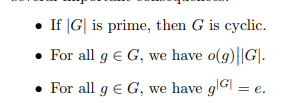

# Workshop Materials

**Contents**

[Presentation Schedule](https://www.notion.so/df531651418e43a9918f8d6c0cc0c706)

# Week 1

## Topics:
- Subgroups
- Quotients
- The fundamental isomorphism theorems
- Cosets
- The index of a subgroup
- Cauchy's theorem
- Lagrange's theorem
- Definitions and properties of common special families of groups:
	- Cyclic groups
	- Symmetric groups
	- Alternating groups
	- Dihedral groups

- Subgroups, quotients, isomorphism theorems, cosets, index of a subgroup
- Cauchy, Lagrange
- Everything about: cyclic, symmetric, alternating, dihedral groups of order ≤ 20

Prove Lagrange's theorem

Prove the following:

Prove the fundamental theorem of cosets

Prove that all cosets have the same cardinality.

Prove that a group homomorphism $\phi: G\to H$ is trivial iff $\ker \phi = e_G$

Show that the image $\phi(G) \leq H$ is a subgroup and $\ker \phi \normal G$ is a normal subgroup

Prove the 1st isomorphism theorem

Show that every element of $S_n$ can be written as a product of transpositions.

Prove that if G/Z(G) then G is abelian

Classify all groups of order p^2

# Week 2

- Special types of groups, the symmetric group, p-groups
- Series of groups, solvable, simple, nilpotent; Jordan-Holder theorem
- Group actions, orbit-stabilizer, class equation,
- Cayley representation, permutation representation

# Week 4

- Morphisms, Ideals, quotients, zero divisors, isomorphism theorems, CRT
- Irreducible and prime elements, nilpotent, units
- Radical, nilradical, spec and maxspec
- Special types: domains, integral domains, Euclidean ⇒ PID ⇒ UFD ⇒?, Dedekind domains, Noetherian, Artinian
- Zorn's lemma arguments
- Bonus optional stuff: localization

Prove that a commutive ring with unit is a field if and only if its only ideals are {0} and the whole ring

Show the irreducibility criterion for polynomials f ∈ k[x] of degree 2 or 3: such a polynomial is irreducible iff it has no roots in the field k

