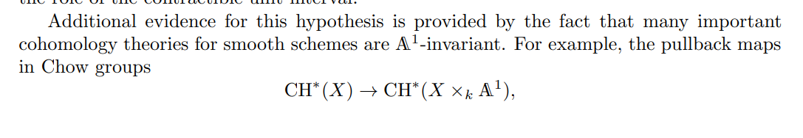
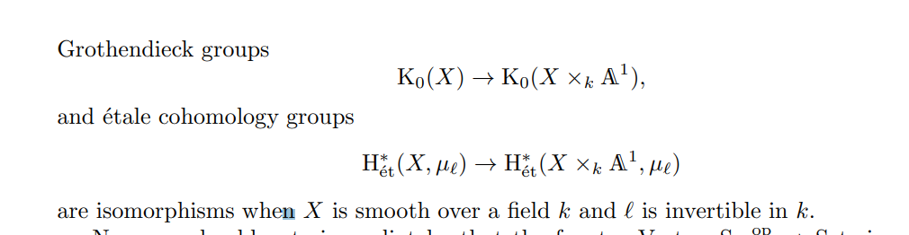

# References

- [A primer for unstable motivic homotopy theory](https://arxiv.org/pdf/1605.00929.pdf)
- <https://ams.org/journals/notices/202001/rnoti-p9.pdf>
- [Introduction to mixed motives](https://etale.site/livetex/cisinski-at-motives-and-DAG.pdf)

# Motivation
- Motives: fundamental building blocks of algebraic varieties
	- See [reciprocity conjecture](reciprocity%20conjecture) and a special case, [Shimura-Taniyama-Weil](Shimura-Taniyama-Weil)
- Notation: $\Vect_r(X)$: iso classes of rank $r$ vector bundles over $X$.
- Goal: classify vector bundles on smooth affine schemes.
- Serre's conjecture: for $k\in \Fields$, is every \( M\in \modsleft{\kxn}^\fg \) actually free?
	- True by Quillen-Suslin 76
- Open problem (Bass-Quillen): is pullback-induced map $\Vect_r(X) \to \Vect_r(X \cross \AA^n)$ a bijection?
	- Proved in special cases, generally open
  - Analogy: $\Vect_r(X) \mapsvia{\sim} \Vect_r(X \cross I^n)$ in $\CW$

- [Nisnevich topology](Nisnevich%20topology): coarsest where [[purity theorem]] holds, finest where [[K-Theory]] is representable.

> The fundamental difference between **pure motives** (coming from cohomology of smooth projective varieties) and **mixed motives** (coming from cohomology of arbitrary varieties) is existence of nontrivial extensions in the mixed motive setting.

