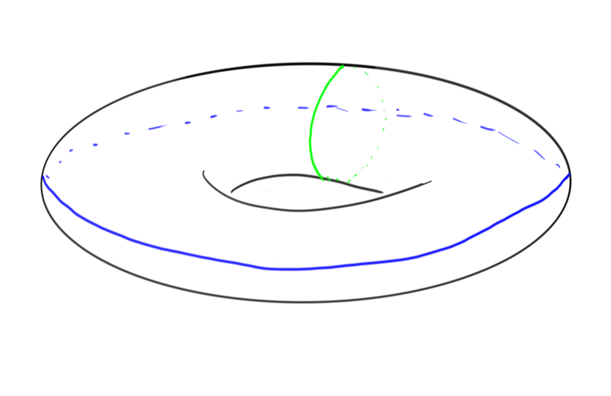
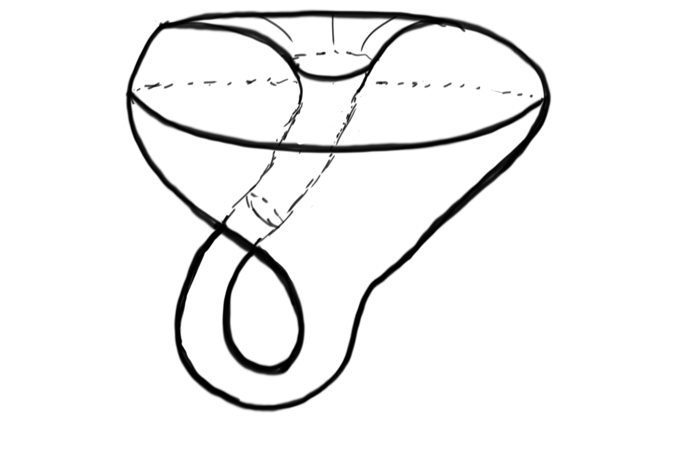

# Vector Bundles

:::{.definition title="Rank of a vector bundle"}
A **rank $n$ vector bundle** is a [fiber bundle](fiber%20bundle.md) in which the fibers $F$ have the structure of a vector space $k^n$ for some field $k$; the [structure group](Reduction%20of%20structure%20group.md) of such a bundle is a subset of $\GL(n, k)$.
:::

:::{.remark}
Note that a vector bundle always has one [global section](section%20of%20a%20bundle.md): namely, since every fiber is a vector space, you can canonically choose the 0 element in every fiber.
This yields [[global section]], the [[zero section]].
:::

:::{.definition title="Trivial bundle"}
A vector bundle $F\to E\to B$ is **trivial** if $E \cong F \cross B$.
:::

See also [parallelizable](framed.md) manifolds.

:::{.proposition title="Trivial iff linearly independent sections"}
A rank $n$ vector bundle is trivial iff it admits $k$ linearly independent global sections.
:::

:::{.example title="?"}
The tangent bundle of a manifold is an $\RR$-vector bundle. Let $M^n$ be an $n\dash$dimensional manifold. For any point $x\in M$, the tangent space $T_xM$ exists, and so we can define
$$
TM = \coprod_{x\in M} T_xM = \theset{(x, t) \mid x\in M, t \in T_xM}
$$

Then $TM$ is a manifold of dimension $2n$ and there is a corresponding fiber bundle
$$
\RR^n \to TM \mapsvia{\pi} M
$$

given by a natural projection $\pi:(x, t) \mapsto x$
:::

:::{.example title="?"}
A circle bundle is a fiber bundle in which the fiber is isomorphic to $S^1$ as a topological group. Consider circle bundles over a circle, which are of the form
$$
S^1 \to E \mapsvia{\pi} S^1
$$

There is a trivial bundle, when $E = S^1 \cross S^1 = T^2$, the torus:

There is also a nontrivial bundle, $E = K$, the Klein bottle:

As in the earlier example involving the [Möbius strip](Möbius%20strip), since $K$ is [nonorientable](orientable), $T^2 \not\cong K$ and there are thus at least two distinct bundles of this type.
:::

