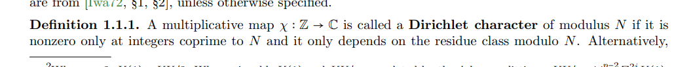
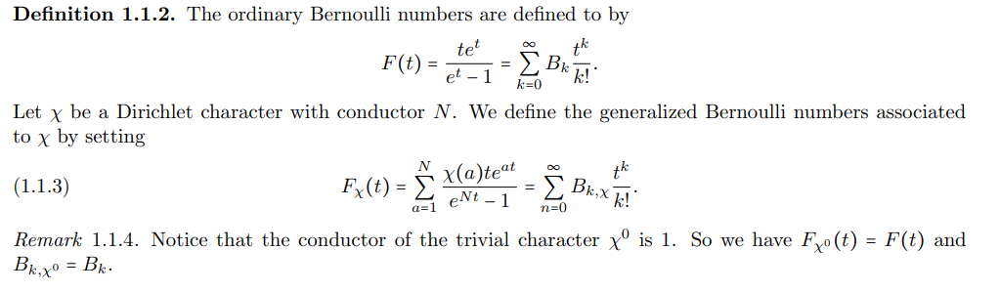

# 2021-03-26

## 20:00

- A Dirichlet character is equivalent to a group homomorphism
\[
\chi:(\mathbb{Z} / N)^{\times} \rightarrow \mathbb{C}^{\times}
.\]

- Definition of a Dirichlet $L\dash$function:
\[
L(s ; \chi):=\sum_{n=1}^{\infty} \frac{\chi(n)}{n^{s}}
=
=\prod_{p}\left(1-\chi(p) p^{-s}\right)^{-1}
.\]

