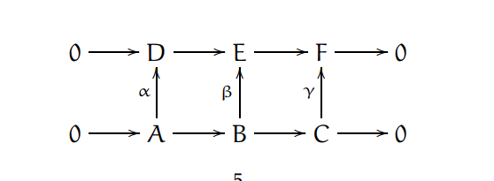

# Research Notes 1-21

Easy definition: A *spectral sequence* is the data $\{(E_r, d_r)\}_{r\in\ZZ}$ where each $E_r$ is an abelian group, $d_r: E_r \into E_r$ is a homomorphism satisfying $d_r^2=0$, and $E_{r+1} \cong \frac{\ker d_r}{\im d_r}$.

Another definition: a *homological spectral sequence* is a sequence of $\ZZ$-bigraded modules $\{E^r_{p,q}\}_{r > 0}$ with differentials $d_r: E^r_{p,q} \into E^r_{p-r, q+(r-1)}$ such that $E^{r+1} = H_*(E^r)$.

A *cohomological spectral sequence* is the same, except $d_r: E_r^{p,q} \into E_r^{p+r, q-(r-1)}$

The 'lines' with slope $-\frac{r-1}{r}$ form chain complexes.

Define cycles to be $Z_i \definedas \ker d_i$, boundaries to be $B_i: \im d_i$.

Concrete examples for pages:

$r=1$: Differential is $d_1:E^1_{p,q} \into E^1_{p-1, q}$

$r=2$: Differential is $d_2:E^2_{p,q} \into E^2_{p-2, q+1}$

​	Equivalently, $d_2: H_*(E^1_{p,q}) \into H_*(E^1_{p-1, q})$?

$r=3$: Differential is $d_3: E^3_{p,q} \into E^3_{p-3,q+2}$

Should be able to compute the cohomology rings of fiber bundles $E \mapsvia{f} B$ pretty easily, using the map induced by the cup product $E_r^{i,j} \cross E_r^{k,l} \into E_r^{i+k, j+l}$ and the fact that $E_2^{i,j} = H^i(B, H^j(F)) \Rightarrow H^{i+j}(E, \QQ)$. (For example, try $SO_{n-1} \into SO_n \into S^{n-1}$)

How to put a filtration in the $E^1$ page: ?

Any complex with a two step filtration $F_1 \subset F_0 = K$ is exactly the long exact arising from $0 \injects F^1 \injects F_0 \surjects \frac{F_1}{F_0} \surjects 0$. 

Next simplest example: a three step filtration $F_2 \subset F_1 \subset F_0 = K$. Write down all of the short exact sequences, and relate $H^*(K)$ to $H^*(\frac{F^i}{F^{i+1}})$.

Template: 

| $\mapsvia{d_0^{-2,2}} E_0^{-1,2} \mapsvia{d_0^{-1,2}}$ | $E_0^{0,2} \mapsvia{d_0^{0,2}}$ | $E_0^{1,2}\mapsvia{d_0^{1,2}}$  | $E_0^{2,2}\mapsvia{d_0^{2,2}}$  | $E_0^{3,2}\mapsvia{d_0^{3,2}}$ | $E_0^{4,2} \mapsvia{d_0^{4,2}}$ | $E_0^{5,2} \mapsvia{d_0^{5,2}}$ |
| ---------------------------------------- | ------------------------------- | ------------------------------- | ------------------------------- | ------------------------------ | ------------------------------- | ------------------------------- |
| $\mapsvia{d_0^{-2,1}} E_0^{-1,1}\mapsvia{d_0^{-1,1}}$ | $E_0^{0,1} \mapsvia{d_0^{0,1}}$ | $E_0^{1,1}\mapsvia{d_0^{1,1}}$  | $E_0^{2,1}\mapsvia{d_0^{2,1}}$  | $E_0^{3,1}\mapsvia{d_0^{3,1}}$ | $E_0^{4,1}\mapsvia{d_0^{4,1}}$  | $E_0^{5,1} \mapsvia{d_0^{5,1}}$ |
| $\mapsvia{d_0^{-2,0}}E_0^{-1,0} \mapsvia{d_0^{-1,0}}$ | $E_0^{0,0} \mapsvia{d_0^{0,0}}$ | $E_0^{1,0} \mapsvia{d_0^{1,0}}$ | $E_0^{2,0} \mapsvia{d_0^{2,0}}$ | $E_0^{3,0}\mapsvia{d_0^{3,0}}$ | $E_0^{4,0}\mapsvia{d_0^{4,0}}$  | $E_0^{5,0} \mapsvia{d_0^{5,0}}$ |
| $\mapsvia{d_1^{-2,2}} E_1^{-1,2} \mapsvia{d_1^{-1,2}}$ | $E_1^{0,2} \mapsvia{d_1^{0,2}}$ | $E_1^{1,2}\mapsvia{d_1^{1,2}}$  | $E_1^{2,2}\mapsvia{d_1^{2,2}}$  | $E_1^{3,2}\mapsvia{d_1^{3,2}}$ | $E_1^{4,2} \mapsvia{d_1^{4,2}}$ | $E_1^{5,2} \mapsvia{d_1^{5,2}}$ |

| $\mapsvia{d_1^{-2,1}} E_1^{-1,1}\mapsvia{d_1^{-1,1}}$ | $E_1^{0,1} \mapsvia{d_1^{0,1}}$ | $E_1^{1,1}\mapsvia{d_1^{1,1}}$  | $E_1^{2,1}\mapsvia{d_1^{2,1}}$  | $E_1^{3,1}\mapsvia{d_1^{3,1}}$ | $E_1^{4,1}\mapsvia{d_1^{4,1}}$  | $E_1^{5,1} \mapsvia{d_1^{5,1}}$ |
| $\mapsvia{d_1^{-2,0}}E_1^{-1,0} \mapsvia{d_1^{-1,0}}$ | $E_1^{0,0} \mapsvia{d_1^{0,0}}$ | $E_1^{1,0} \mapsvia{d_1^{1,0}}$ | $E_1^{2,0} \mapsvia{d_1^{2,0}}$ | $E_1^{3,0}\mapsvia{d_1^{3,0}}$ | $E_1^{4,0}\mapsvia{d_1^{4,0}}$  | $E_1^{5,0} \mapsvia{d_1^{5,0}}$ |

## Example: Proving the Snake Lemma without chasing elements

Given the following diagram, with exact rows and commuting squares:

We want to show that this sequence34w is exact:

$$ 0 \mapsvia{} \ker \alpha \mapsvia{} \ker \beta \mapsvia{} \ker\gamma \mapsvia{\delta} \im\alpha \mapsvia{} \im\beta \mapsvia{}\im\gamma \mapsvia{} 0$$