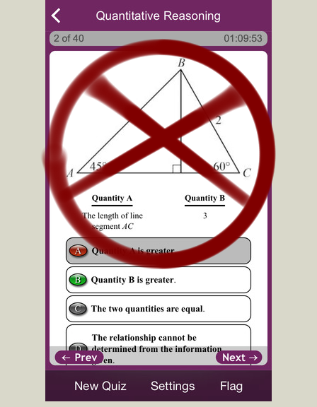

---
presentation:
  margin: 0.0
  theme: serif.css
---

<!-- slide -->

# Mathematics Subject GRE Workshop

<!-- slide -->
# Agenda
- Description of Mathematics Subject GRE
- Topics it covers
- Exam logistics
- Recommended resources
- Study techniques/tips
- Review of topics + sample problems

<!-- slide -->

## What is the Mathematics Subject GRE?

- Different from the Math section of the *General* GRE
- Required of graduate student applicants to many Math Ph.D. programs
- Tests a breadth of undergraduate topics

<!-- slide -->
# What topics does it cover?

- Calculus (50%)
  - Single Variable
  - Multivariable
  - Differential Equations

<!-- slide vertical=true-->
- "Algebra" (25%)
  - Linear Algebra
  - Abstract Algebra 
  - Number Theory

<!-- slide vertical=true-->
- Mixed Topics (25%)
  - Real Analysis
  - Logic / Set Theory
  - Discrete Mathematics
  - Point-Set Topology
  - Complex Analysis
  - Combinatorics
  - Probability
  

<!-- slide -->
# Logistics

- Multiple choice, 5 choices
- 66 questions, 170 minutes
- No downside to guessing
- Only offered 3x/year 
- Need to register ~2 months in advance

<!-- slide -->
# References

- Garrity, [All the Mathematics You Missed (But Need to Know for Graduate School)](https://www.amazon.com/All-Mathematics-You-Missed-Graduate/dp/0521797071)

- The Princeton Review, [Cracking the Math GRE Subject Test](https://www.amazon.com/Cracking-GRE-Mathematics-Subject-Test/dp/0375429727)

- Five Official Practice Exams
	- GR 1268
	- GR 0568
	- GR 9367
	- GR 8767
	- GR 9768

<!-- slide -->
# General Tips

- Start early
- Speed is important
- Focus on lower div
- Drill *a lot* of problems
- Memorize formulas and definitions
- Spaced repetition
- Save actual exams
- Replicate exam conditions
- Self care!!

<!-- slide -->
# Single Variable Calculus

<!-- slide vertical=true -->
## Derivatives
- Computing limits
- Showing continuity
- Computing derivatives
- Mean Value Theorem
- Extreme Value Theorem
- Rolle's Theorem
- Implicit Differentiation
- Related Rates
- Optimization
- Computing Taylor expansions
- Computing linear approximations

<!-- slide vertical=true -->
## Integrals
- Riemann sum definition of the integral
- The fundamental theorem of Calculus (both forms)
- Computing antiderivatives
  - $u\dash$substitutions
  - Partial fraction decomposition
  - Trigonometric Substitution
  - Integration by parts
  - Specific integrands
- Computing definite integrals
- Solids of revolution
- Series (see real analysis section)

<!-- slide -->
# Multivariable Calculus

<!-- slide vertical=true -->
- Vectors, div, grad, curl
- Equations of lines, planes, paramaterized curves
  - And finding intersections thereof
- Multivariable Taylor series
- Computing linear approximations
- Lagrange Multipliers
- Multivariable optimization
- Arc lengths of curves
- Line integrals, surface integrals
- Green's Theorem
- The divergence theorem
- Stoke's Theorem

<!-- slide -->
# Linear Algebra
<!-- slide vertical=true -->
- Systems of equations
- Row operations, Gaussian elimination, REF, RREF
- Determinant, inversion, trace
- Vector spaces and subspaces
- Rank-nullity
- Computing nullspace, colspace, rowspace, eigenvalues/eigenvectors
- Big list of equivalent conditions for invertibility
- Canonical forms
- Quadratic forms

<!-- slide -->
# Ordinary Differential Equations
<!-- slide vertical=true -->
- General solutions to $\sum_{i=0}^n \alpha_i y^{(i)}(x) = f(x)$

<!-- slide -->
# Topics: Discrete Mathematics
<!-- slide vertical=true -->
- Graphs, trees
- Recurrence relations

<!-- slide -->
# Topics: Number Theory
<!-- slide vertical=true -->
- Divisibility
- Congruence
- Prime factorization
- The totient function
- Group-theoretic properties of $\ZZ/n\ZZ$

<!-- slide -->
# Topics: Abstract Algebra
<!-- slide vertical=true -->
svc 1

<!-- slide -->
# Topics: Real Analysis
<!-- slide vertical=true -->
- Properties of Metrics and Metric Spaces
- The Cauchy-Schwarz Inequality
- Definitions of Sequences and Series
- Testing Convergence of a Series:
	- Integral Test
	- Ratio Test
	- Root Test
	- $p$ Test
- Cauchy Sequences
- Commuting limiting operations:
	- $[\frac{\partial}{\partial x}, \int dx](f)$
- Uniform and point-wise continuity
- Lipschitz Continuity

<!-- slide -->
# Topics: Point-Set Topology
<!-- slide vertical=true -->
- Open/closed sets
- Connected, disconnected, totally disconnected, etc

<!-- slide -->
# Topics: Complex Analysis
<!-- slide vertical=true -->
svc 1

<!-- slide -->
# Conclusion