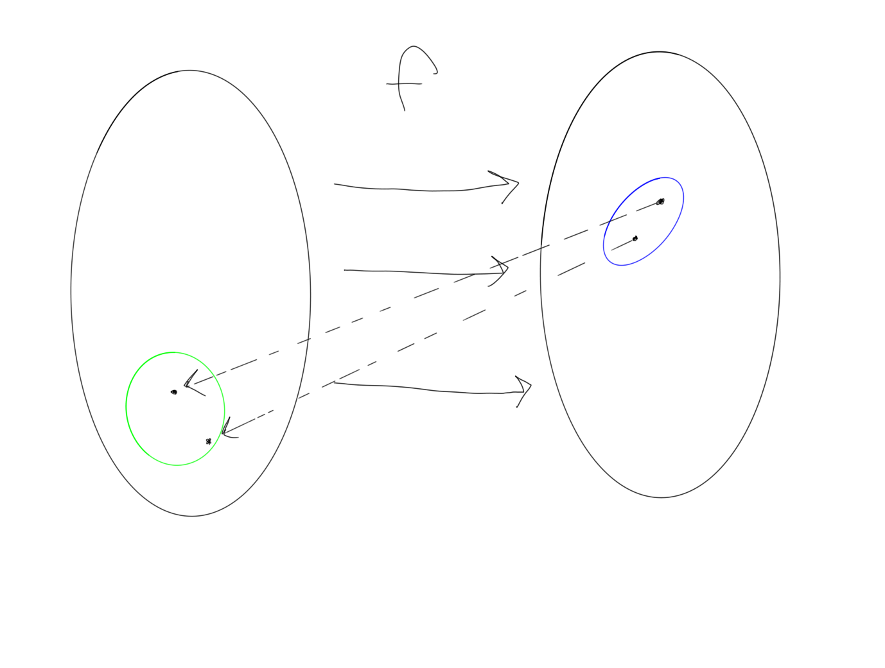
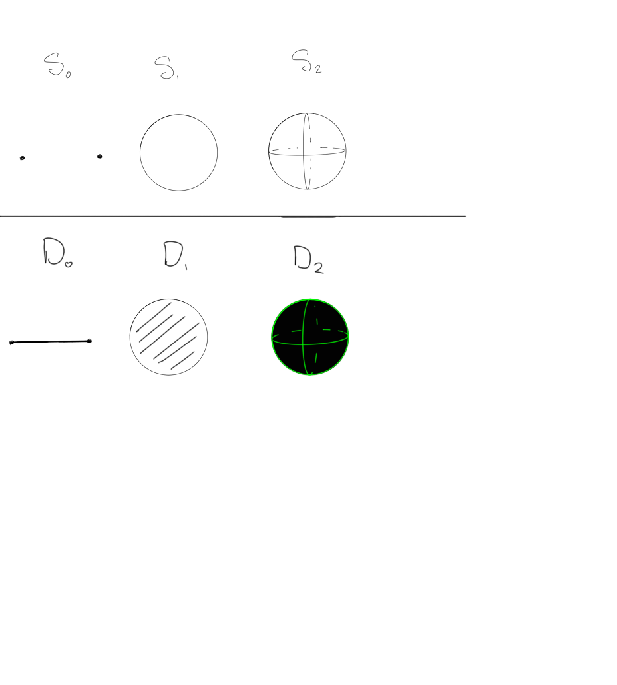
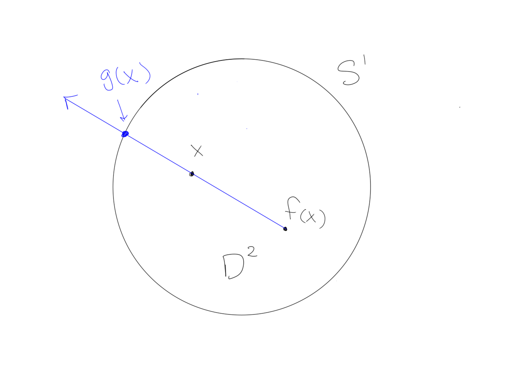
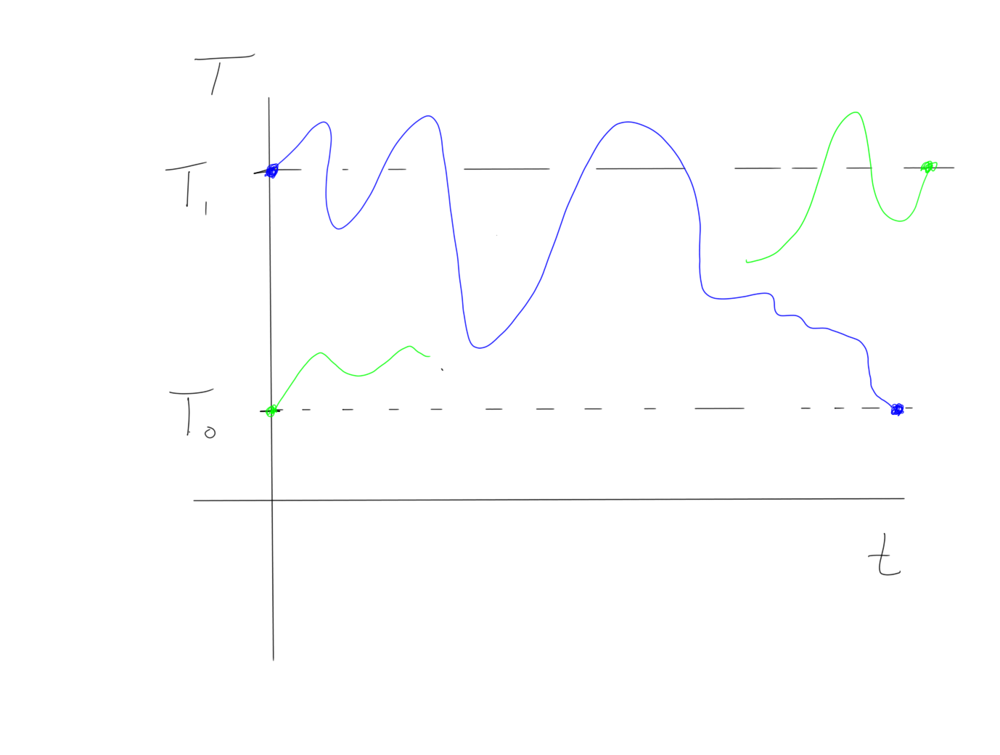

# Topological Fixed Point Theorems

- Fundamental group
- Coffee cup
- Crinkling paper

# Continuity
What is continuity? Stirring coffee, crumpling paper, anything not involving cutting or gluing.

If points are nearby in the target, they must have come from nearby points in the source.



In topology, we think of spaces as being made of some soft, pliable substance like clay, and so continuous transformations are analogous to bending, stretching, and reshaping clay without tearing it apart or sticking two portions together.

Note that this is weaker than something like diffeomorphism, where we would want to do this in a differentiable way - i.e. not introduce places where a tangent plane couldn't be defined. So in topology, we can identify something like the surface of a sphere and the surface of a cube (which are homeomorphic but not diffeomorphic).

(As a motivation for this kind of definition, I often think of things like Gauss's Law in electromagnetism - if you only want to detect whether there is a source or a sink in some region of space, you enclose it in _some_ shape, where the actual details of the surrounding shape don't matter as much.)




# Fixed Points

Why does repeatedly hitting cosine converge? Because $\cos: [0, 1] \to [0, 1]$ can be identified as $\cos: D^0 \to D^0$. Can also be identified using the following graph:

```python {cmd=true matplotlib=true}
import numpy as np
import matplotlib.pyplot as plt

t1 = np.arange(0.0, 1.0, 0.05)
plt.plot(t1, np.cos(t1), 'b', label="$f(x)=\cos(x)$")
plt.plot(t1, t1, 'r', label="$f(x)=x$")
plt.legend(bbox_to_anchor=(1.05, 1), loc=2, borderaxespad=0.)
plt.show()
```

Note that "fixed point problems" are in bijective correspondence with "finding the zero of a function" problems - for example, a fixed point satisfies $f(x) = x$, but this can equivalently be stated as looking for the zeros of the function $g(x) = f(x) - x$, so $g(x) = 0 \iff f(x) -x = 0 \iff x = f(x)$. So we can equivalently look for zeros on the graph of $g(x)$:

```python {cmd=true matplotlib=true}
import numpy as np
import matplotlib.pyplot as plt

t1 = np.arange(0.0, 1.0, 0.05)
plt.plot(t1, np.cos(t1) - t1, 'b', label="$f(x)=\cos(x) - x$")
plt.xlim(0, 1)
plt.ylim(0, 1)
plt.legend(bbox_to_anchor=(1.05, 1), loc=2, borderaxespad=0.)
plt.show()
```
And here we see that there is at least one zero in the interval $[0,1]$, located somewhere around $0.75$.

(Aside: Feynman once joked that the entirety of physics could be modeled by $U = 0$ for some function $U$, where you just collected every equation known to man on the left-hand side and called it $U$.)


# Brouwer's Fixed Point
Take two pieces of paper, put identical cartesian coordinates on both, lay one on a table - then crumple the other one in any way, and lay it on top. Then it is technically possible to take a pen and pierce through both papers in such a way that the mark passes through the same coordinates on both.

Formally: any $f: D^2\selfmap$ has a fixed point, i.e. an $x\in D^2$ such that $f(x) = x$.

By contradiction: suppose this doesn't hold.

Fact: $\pi_1(S^1) = \ZZ$ and $\pi_1(D^2) = 0$. Then define a new function $g: D^2 \to \del D^2 = S^1$ by drawing a line from $f(x)$ through $x$ and picking the point it hits on the boundary.



Extending to higher dimensions: look at a cup of coffee, then imagine


# Borsuk Ulam:

There exist a pair of antipodal points with same temperature and pressure. There are _infinitely_ many antipodal points with the same temperature!

What is an antipode? Given any point $A$, you can find its antipode by drawing a line through the center of the sphere - the antipode is the other spot in which this line intersects the sphere.

Idea: pick a point $A$ (say the bottom blue point in the diagram), then it has a unique antipode $B$ (say the top blue circle). Place a thermometer at both locations, then pick any path from $A$ to $B$ over the surface of the Earth - thinking of this path as something traversed over time, we can normalize so that this it is traversed between $t=0$ and $t=1$.

This gives a continuous function $\gamma: [0, 1] \to S^2$ where $\gamma(0) = A$ and $\gamma(1) = B$.

Then this induces a "mirror" path that $B$ takes, if we always place $B$ at the antipode of $A$, wherever it is along the path.


Then consider holding a thermometer, taking readings at $A$ and $B$, and continuously taking temperatures as you traverse this path. Since $A$ ends up at where $B$ started, following this path just swaps the temperatures!

So let's look at what's happening on a temperature vs. time graph:



Say blue is the path taken by $A$, and green by $B$. We know the temperatures measured by $A$ and $B$ at the start of their trip, and that the temperatures must have swapped by the end. We also know that the temperature varies on $A$'s journey looks something like the blue line - so this means the two lines have to cross at _some_ point in this interval!

This is an intuitive argument, but can be made rigorous by looking at a function like
$$f: [0, 1] \to \RR \\ t\mapsto  T_1(\gamma(t)) - T_0(\gamma(t))$$.

(All this means is that we evaluate the temperature at every physical point along the path.)

Without loss of generality, $T_1(\gamma(0)) > T_2(\gamma(0))$, so $f(0) > 0$. But because these switch by the end, we must have $T_1(\gamma(1)) < T_0(\gamma(1))$, and so $f(1) < 0$. Since $f$ is continuous, we can apply the Intermediate Value Theorem to conclude that $f(t) = 0$ for some $t\ in [0,1]$.

But this works for _any_ path, which means there must be a band homeomorphic to $S^1$, which is mirrored antipodally, for which the antipodal temperatures are equal. This is the red curved line in the first figure. This is the set of points for which there is an anitpodal point of the same temperature. Note that this set must be a connected band - if it were not, you could find one path avoiding all of those points, yielding a path with no equal antipodal temperatures, contradicting our earlier findings.

So we can apply this argument again with some other real measurement - say pressure, to find two antipodal points on this $S^1$ that have the same value.


# Applications

- Banach fixed point theorem - used to show existence and uniqueness of certain ODEs by applying an integral operator to functions in $C^1(\RR)$, which contracts this space and yields a fixed point.
