# Unit 3: Trigonometric Functions

## General Notes

- In this section, always draw a picture! 
  Virtually 100% of the time.

  - In particular, a unit circle should almost always show up.

- Use exact ratios wherever possible.

- There are too many details and formulas to just memorize in this unit: focus on the **processes**.

## Common Mistakes

Some facts to remember:

- $\sin\inv(\theta) \neq 1/\sin(\theta)$.
  Mnemonic: reciprocals of trigonometric functions already have a better name, here $\csc(\theta)$.

## Basic Trigonometric Functions

\todo[inline]{Sin/cos/etc as ratios}

## Proportionality Relationships

:::{.definition title="Radian"}
\todo[inline]{What is a 1 radian?}

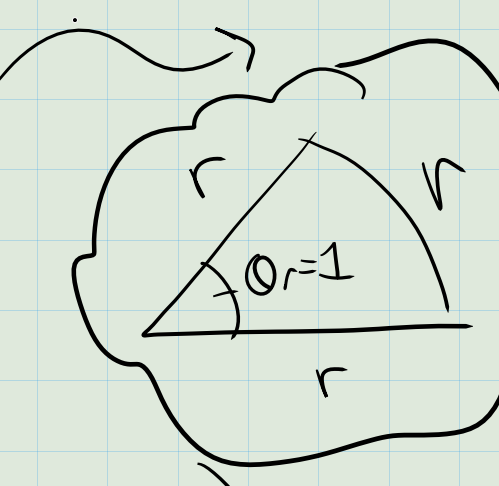

:::

:::{.remark}
In geometric terms, an angle in radians in the ratio of the arc length $s(\theta, R)$ to the radius $R$, so
\[
\theta_R = {s(\theta, R) \over R}
.\]
:::

:::{.definition title="Coterminal Angles"}
If $\theta$ is an abstract angle, we will say $\theta + k\,\text{rev} \simeq \theta$ for any integer $k\in \ZZ$. 
Any such angle is said to be **coterminal** to $\theta$.
:::

:::{.remark}
In radians:
\[
\theta_R \simeq \theta_R + k\cdot 2\pi && k\in \ZZ
.\]

In degrees:
\[
\theta_D \simeq \theta_D + k\cdot 360^\circ && k\in \ZZ
.\]

:::

:::{.proposition title="Degrees are related to radians"}
\todo[inline]{todo}
\[
{\theta \over 1\,\text{rev}} = {\theta_R \over 2\pi\, \text{rad} } = {\theta_D \over 360^\circ}
.\]

:::

:::{.proposition title="Arc length and sector area are related to radians"}
\todo[inline]{todo}
\[
{\theta \over 1\,\text{rev}}
= 
{s(R, \theta) \over 2\pi R} 
= 
{ A(R, \theta) \over \pi R^2 }
.\]

This implies that
\[
A(R, \theta) &={R^2 \theta \over 2} \\
s(R, \theta) &= R\theta
.\]

:::

## Trigonometric Functions as Ratios

:::{.definition title="?"}
There are 6 trigonometric functions defined by the following ratios:

\todo[inline]{soh-cah-toa, cho-sha-cao}

:::

:::{.proposition title="Domains of trigonometric functions"}

| Function | Domain | Range |
|----------|--------|-------|
|$\sin$    | $\RR$  | $[-1, 1]$     |
|$\cos$    | $\RR$  | $[-1, 1]$     |
|$\tan$    | $\RR \smts{\pm {\pi \over 2}, \pm{3\pi \over 2}, \cdots}$  | ?     |
|$\csc$    | $\RR \smts{0, \pm {\pi}, \pm{2\pi}, \cdots}$  | ?     |
|$\sec$    | $\RR \smts{\pm {\pi \over 2}, \pm{3\pi \over 2}, \cdots}$  | ?     |
|$\cot$    | $\RR \smts{0, \pm {\pi}, \pm{2\pi}, \cdots}$  | ?     |

:::

## Polar Coordinates

:::{.definition title="Unit Circle"}
The **unit circle** is defined as 
\[
S^1 \da \ts{ \vector p = (x, y) \in \RR^2 \st d(\vector p, \vector 0) = 1 } = \ts{ (x, y) \in \RR^2 \st x^2 + y^2 = 1 } 
,\]
the set of all points in the plane that are distance exactly 1 from the origin.
:::

:::{.theorem title="Polar Coordinates"}
If a vector $\vector v$ has at an angle of $\theta$ in radians and has length $R$, the corresponding point $\vector p$ at the end of $\vector v$ is given by
\[
\vector p = \tv{x, y} = \tv{R\cos(\theta), R\sin(\theta)}
.\]

Conversely, if $(x, y)$ are known, then the corresponding $R$ and $\theta$ are given by
\[
[R, \theta] = \tv{ \sqrt{x^2 + y^2}, \arctan\qty{y\over x} }
.\]
:::

:::{.corollary title="Polar Coordinates on $S^1$"}
If $R=1$, so $\vector v$ is on the unit circle $S^1$, then
\[
[x, y] = [\cos(\theta), \sin(\theta)]
.\]
:::

:::{.remark}
This is a very important fact!
The $x, y$ coordinates on the unit circle *literally* corresponding to cosines and sines of subtended angles will be used frequently.
:::

:::{.slogan}
Cosines are like $x$ coordinates, sines are like $y$ coordinates.
:::

:::{.example title="?"}
Given $\theta_R = 4\pi/3$, what is the corresponding point on the unit circle $S^1$?
:::

:::{.warnings}
Note that $\sin(\theta), \cos(\theta)$ work for any $\theta$ at all.
However, $\cos(\theta) = 0$ sometimes, so $\tan(\theta) \da \sin(\theta) / \cos(\theta)$ will on occasion be problematic.
Similar story for the other functions.
:::

## Special Angles
For reference: the unit circle.

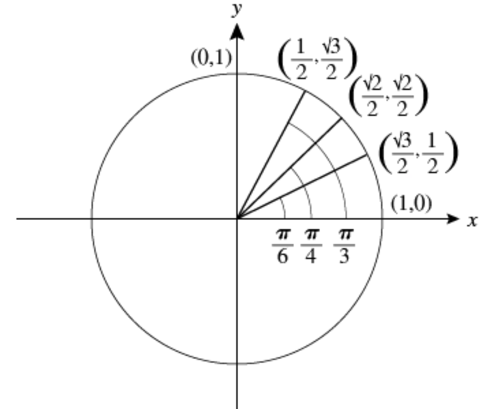

:::{.remark}
Idea: we want to partition the circle simultaneously

- Into 8 pieces, so we increment by $2\pi/8 = \pi/4$
- Into 12 pieces, so we increment by $2\pi/12 = \pi/6$.
:::

:::{.proposition title="Trick to memorize special angles"}
\todo[inline]{Table of special angles, increasing/decreasing}

:::

## Reference Angles and the Flipping Method

:::{.definition title="Reference Angle"}
Given a vector at of length $R$ and angle $\theta$, the **reference angle** 
$\thetaref$ is the acute angle in the triangle formed by dropping a perpendicular to the nearest horizontal axis.
:::

:::{.proposition title="?"}
Reference angles for each quadrant:
\[
\text{Quadrant II}: && \theta + \thetaref = \pi \\
\text{Quadrant III}: && \pi + \thetaref = \theta \\
\text{Quadrant IV}: && \theta + \thetaref = 2\pi
.\]

:::

:::{.example title="?"}
Given $\sin(\theta) = 7/25$, what are the five remaining trigonometric functions of $\theta$?

Method:

1. Draw a picture! 
  Embed $\theta$ into a right triangle.
2. Find the missing side using the Pythagorean theorem.
3. Use definition of trigonometric functions are ratios.
:::

:::{.remark}
Note that you can not necessarily find the angle $\theta$ here, but we didn't need it.
If we *did* want $\theta$, we would need an inverse function to free the argument:
\[
\sin(\theta) &= 7/25 \\
\implies \arcsin( \sin(\theta) ) = \arcsin(7/25) \\
\implies \theta = \arcsin(7/25) \\
.\]

:::

## Identities Using Pythagoras

:::{.proposition title="?"}
\[
(\sin(\theta))^2 + (\cos(\theta))^2 &= 1 \\
1 + (\cot(\theta))^2 &= (\csc(\theta))^2 \\
(\tan(\theta))^2 + 1 &= (\sec(\theta))^2
.\]
:::

:::{.proof title="?"}
Derive first from Pythagorean theorem in $S^1$.
Obtain the second by dividing through by $\qty{\sin(\theta)}^2$.
Obtain the third by dividing through by $\qty{\cos(\theta)}^2$.
:::

## Even/Odd Properties

:::{.question}
Thinking of $\cos(\theta)$ as a function of $\theta$, is it

- Even?
- Odd?
- Neither?
:::

:::{.remark}
Why do we care?
The Fundamental Theorem of Calculus.

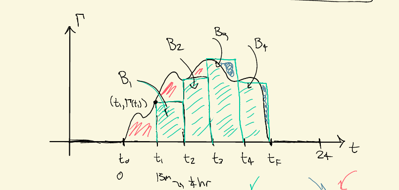
:::

:::{.proposition title="?"}
\envlist

- $f(\theta) \da \cos(\theta)$ is an even function.
- $g(\theta) \da \sin(\theta)$ is an odd function.

:::

:::{.proof title="?"}
Plot vectors for $\theta, -\theta$ on $S^1$ and flip over the $x\dash$axis.
:::

:::{.corollary title="?"}
\envlist

- $\cos(t), \sec(t)$ are even.
- $\sin(t), \csc(t), \tan(t), \cot(t)$ are odd.

:::

## Wave Function

:::{.remark}
Motivation: let a vector run around the unit circle, where we think of $\theta$ as a time parameter.
What are its $x$ and $y$ coordinates?
What happens if we plot $x(t)$ in a new $\theta$ plane?
:::

:::{.definition title="Standard Form of a Wave Function"}
The **standard form** of a wave function is given by 
\[
f(t) \da A \cos(\omega (t - \varphi)) + \delta
,\]

where 

- $A$ is the **amplitude**,
- $\omega$ is the **frequency**,
- $\phi$ is the **phase shift**, and
- $\delta$ is the **vertical shift**.
- $P \da 2\pi / \omega$ is the **period**, so $f(t+kP) = f(t)$ for all $k\in \ZZ$.

\todo[inline]{Insert plot}
:::

:::{.remark}
Note that this is nothing more than a usual cosine wave, just translated/dilated in the $x$ direction and the $y$ direction.
:::

:::{.warnings}
Don't memorize equations like $y=\sin(Bt+C)$ and e.g. the phase shift if $\phi = -C/B$.
Instead, use a process: always put your equation in standard form, then you can just read off the parameters.
For example:
\[
f(t) 
&= \cos(Bt+C) \\
&= \cos( B (t + {C\over B}) ) \\
&= \cos(\omega (t - \phi) ) \\ \\
&\implies B = \omega, \phi = -{C\over B}
.\]

:::

:::{.example title="?"}
Put the following wave in standard form:
\[
f(t) \da 4\cos(3t+2)
.\]
:::

:::{.example title="?"}
Put the following wave in standard form:
\[
f(t) \da \alpha \cos(\beta t+\gamma)
.\]
:::

:::{.proposition title="?"}
How to plot the graph of a wave equation:

1. Put in standard form.
2. Read off the parameters to build a rectangular box of width $P$ and height $2\abs{A}$ about the line $y=\delta$.
3. Break the box into 4 pieces using the key points $t = \phi + {k\over 4}P$ for $k=0,1,2,3,4$.
:::

:::{.example title="Plotting"}
Plot the following function in the $t$ plane:
\[
f(t) = 2 \cos\qty{5t - {\pi \over 2} } + 7
.\]

:::

:::{.example title="?"}
Plot the following:
\[
f(t) = -2\sin(3t-7)
.\]
:::

:::{.proposition title="Determining the equation of a sine wave"}
Given a picture of a graph of a sine wave,

1. Draw a horizontal line cutting the wave in half.
  This will be $\delta$.
2. Measure the distance from this midline to a peak.
  This will be $\abs{A}$.
2. Restrict to one full period, starting either at a peak (if you want to match $\cos(t)$) or a zero (if you want to match $\sin(t)$).
  Pick the period starting as close as possible to the $y\dash$axis.
3. Measure the period $P$ and reverse-engineer it to get $\omega$: 
  $P = 2\pi/\omega \implies \omega = 2\pi/P$.
4. Measure the distance from the starting point to the $y\dash$axis: this is $\phi$.

:::

:::{.example title="?"}
Determine the equation of the following wave function:

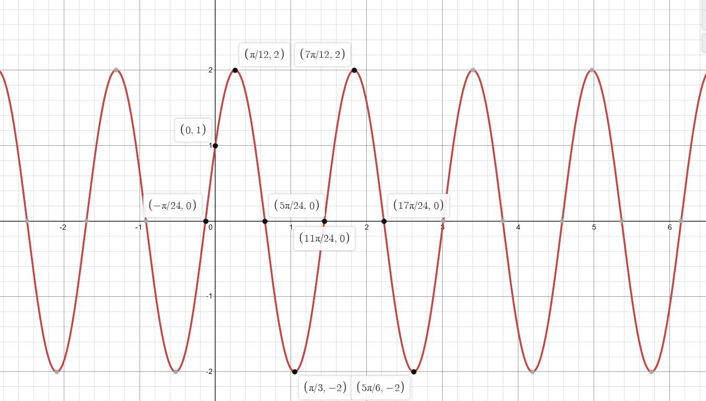

:::{.solution}
\[
f(t) = 2\sin\qty{4t + {\pi \over 6} }
.\]
:::

:::

:::{.remark}
Note that we can graph other trigonometric functions: they get pretty wild though.

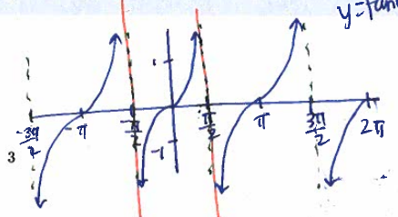

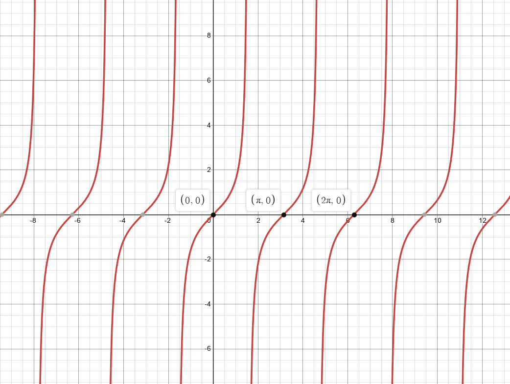

:::

## Simplifying Identities

:::{.remark}
The goal: reduce a complicated mess of trigonometric functions to something as simple as possible.
We'll use a **boxing-up method**.
:::

:::{.remark}
On verifying identities: if you want to show $f(\theta) = g(\theta)$, start at one and arrive at the other:
\[
f(\theta) &= \text{simplify } f \\
&= \cdots \\
&= \cdots \\
&= \cdots \\
&= g(\theta) \\
.\]

:::

:::{.warnings}
If you end up with something like $1=1$ or $0=0$, this is hinting at a problem with your logic.
:::

:::{.exercise title="?"}
Simplify the following:
\[
F(\theta) \da \qty{ \sin(\theta) \cos(\theta) \over \cot(\theta)} \cos(\theta)\csc(\theta)
.\]
:::

:::{.solution}
\[
F = s \qty{s \over c}
.\]

:::

:::{.remark}
As an alternative, you can use the **transitivity of equality**: show that $f(\theta) = h(\theta)$ for some totally different function $h$, and then show $g(\theta) = h(\theta)$ as well.

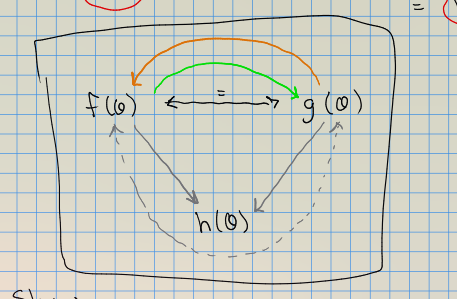

:::

:::{.exercise title="Reducing both sides to a common expression"}
Show the following identity:
\[
{\sin(-\theta) + \csc(\theta)} = \cot(\theta) \cos(\theta)
\]
by showing both sides are separately equal to $h(\theta) \da \csc(\theta) - \sin(\theta)$.

:::

## Inverse Functions

### Motivation

:::{.remark}
Motivation: we want a way to solve equations where the unknown $\theta$ is stuck in the argument of a trigonometric function.
For example, for $\sin: \RR_A \to \RR_B$, this would be some function $f: \RR_B \to \RR_A$ such that
\[
f(\sin(\theta)) &= \id(\theta) = \theta \\
\sin(f(y)) &= \id(y) = y
.\]

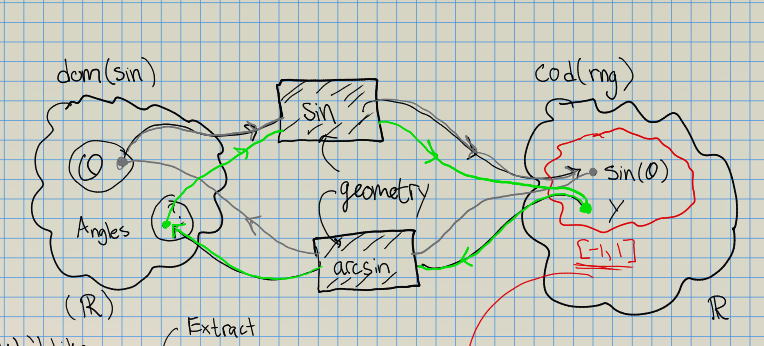

Note that we only ever have to define $f$ on $\range(\sin)$, since we're only ever sending outputs of $f$ in as the inputs of $\sin$.
So we need $\range(\sin) \subset \dom(f)$, noting that $\range(\sin) = [-1, 1]$:
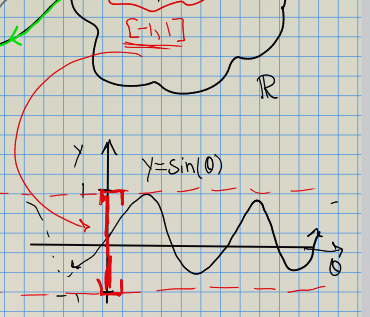

Similarly, we need $\range(f) \subset \dom(\sin)$.
:::

### Using Triangles

:::{.remark}
Optimistically imagine that we had some such inverse function.
Then we could evaluate some expressions without even knowing anything else about it.
The trick: 
\[
\theta &= \arccos(p/q) \\
\implies \cos(\theta) &= \cos(\arccos(p/q)) \\
\implies \cos(\theta) &= p/q
.\]
Now embed this in a triangle.
We can't solve for $\theta$, but we can solve for other trigonometric functions.
:::

:::{.exercise title="Using functional inverse property"}
\[
\cos\qty{ \arccos\qty{ \sqrt 5 \over 5 } } &= {\sqrt 5 \over 5} \\
\arccos\qty{ \cos \qty{ \sqrt 5 \over 5 } } &= {\sqrt 5 \over 5} \\
.\]

:::

:::{.exercise title="Using a triangle"}
\[
\tan\qty{ \arcsin\qty{ p \over q } } = {p \over \sqrt{q^2 - p^2} }
.\]

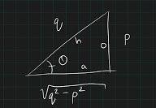

:::

:::{.exercise title="Can't extract angles"}
Compute $\arcsin(3/5)$.

:::{.warnings}
This is equal to $\sin\inv(3/5)$, which is *not* equal to ${1\over \sin(3/5)}$!
One way to remember this is that we have another name for reciprocals, here $\csc(3/5)$.
:::
:::

:::{.solution}
\[
\theta &= \arcsin(3/5) \\
\implies \sin(\theta) &= (3/5) && \text{roughly by injectivity} \\
\implies &= \cdots ?
.\]
We are out of luck, since this isn't a special angle.
So we can't find a numerical value of $\theta$.
We can find other trig functions of $\theta$ though:

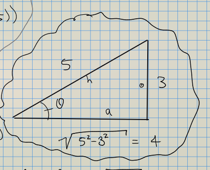

So for example, $\cos(\arcsin(3/5)) = 4/5$.
:::

:::{.remark}
Most inverse trigonometric functions can *not* be exactly solved!
We'll have to approximate by calculator if we want the actual angle.
If we just want *other* trigonometric functions though, we can always embed in a triangle.
:::

:::{.example title="Using triangles"}
Show the following:

- $\cos(\arcsin(24/26)) = 10/26$
  - Write $\theta = \arcsin(24/26)$, note $\theta$ is in $[-\pi/2, \pi/2] = \range(\arcsin)$.
- $\tan(\arccos(-10/26)) = 10/26$
  - Write $\theta = \arccos(-10/26)$, note $\theta$ is in $[0, \pi] = \range(\arccos)$
:::

### Defining Inverses

:::{.remark}
The setup: try swapping $y$ and $\theta$ in the graph of $y=\sin(\theta)$:

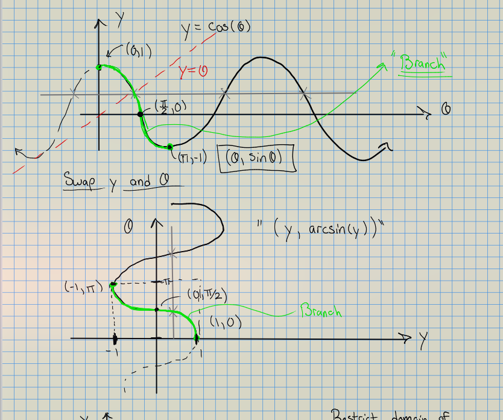

Note that the latter is a function (vertical line test) iff the former is injective (horizontal line test).
So we take the largest branch where the inverse is a function:

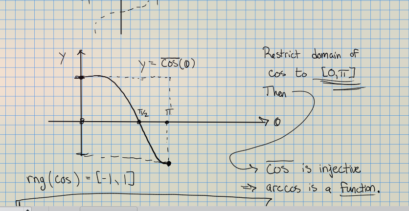

Back on our original graph, this looks like the following:

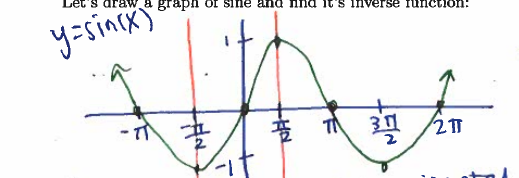

Restricting, we get

- $\dom(\arccos) \da \range({ \color{green} \cos} ) = [-1, 1]$.
- $\range(\arccos) \da \dom( {\color{green} \cos} ) = [0, \pi]$.

:::

:::{.remark}
A similar analysis works for $\sin(\theta)$:

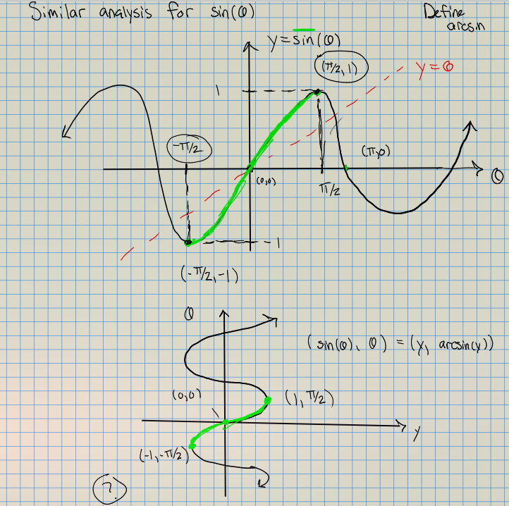

Restricting, we get

- $\dom(\arcsin) \da \range({ \color{green} \sin} ) = [-1, 1]$.
- $\range(\arcsin) \da \dom( {\color{green} \sin }) = [-\pi/2, \pi/2]$.
:::

:::{.remark}
This gives us a new tool to solve equations:
\[
\vdots &= \vdots \\
\implies \cos(x) &= b \\
\implies \arccos(\cos(x)) &= \arccos(b) \\
\implies x &= \arccos(b)
,\]
but only if we know this makes sense based on domain/range issues.

:::

:::{.proposition title="Domains of inverse trigonometric functions"}

Restrict domains in the following ways:

- $\sin$: $[-\pi/2, \pi/2]$
- $\cos: [0, \pi]$
- $\tan: [-\pi/2, \pi/2]$

| Function | Domain | Range |
|----------|--------|-------|
|$\arcsin$    | $[-1, 1]$   | $[-\pi/2, \pi /2]$  |
|$\arccos$    | $[-1, 1]$   | $[0, \pi]$     |
|$\arctan$    | $\RR$       | $(-\pi/2, \pi/2)$     |
|$\arccsc$    | $\RR \smts{0, \pm {\pi}, \pm{2\pi}, \cdots}$  | ?     |
|$\arcsec$    | $\RR \smts{\pm {\pi \over 2}, \pm{3\pi \over 2}, \cdots}$  | ?     |
|$\arccot$    | $\RR \smts{0, \pm {\pi}, \pm{2\pi}, \cdots}$  | ?     |

:::

:::{.slogan}
There is an easy way to remember this:

- Cosines are $x\dash$values, pick the upper (or lower) half of the circle to make them unique.
- Sines are $y\dash$values, pick the right (or left) half of the circle to make them unique.

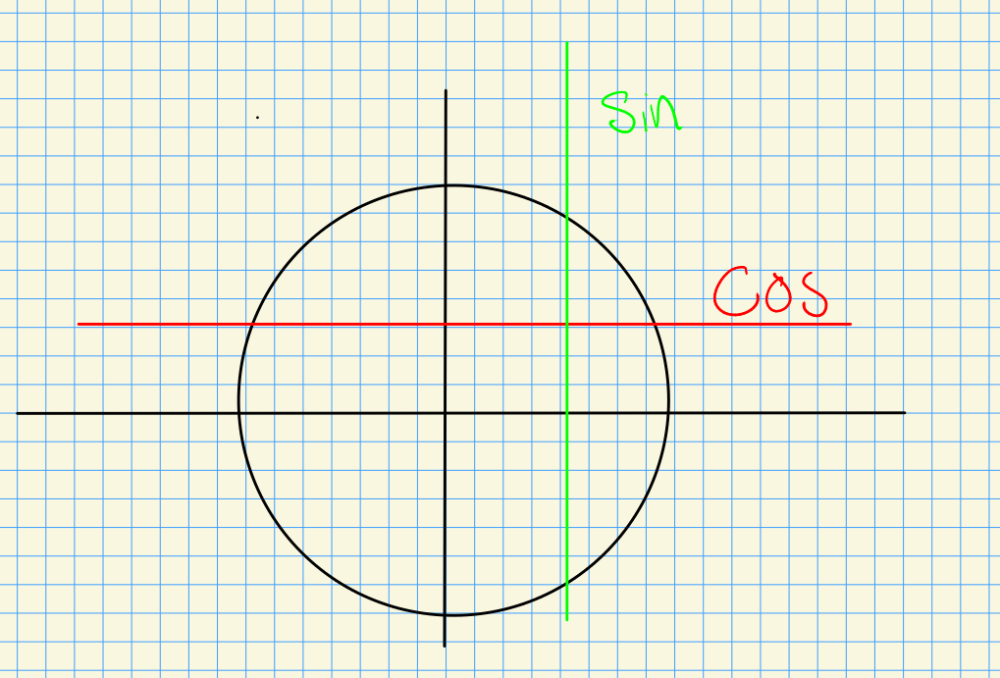

:::

:::{.example title="Using special angles"}

We have some exact values.

Sines should be in QI or QIV:

- $\arcsin(1/2) = \pi/6$
- $\arcsin(\sqrt{3}/2) = \pi/3$
- $\arcsin(-1/2) = -\pi/6$

Cosines should be in QI or QII:

- $\arccos(\sqrt{3}/2) = \pi/6$
- $\arccos(-\sqrt{2}/2) = 3\pi/4$
- $\arccos(1/2) = \pi/3$

Tangents should be in QI or QIV:

- $\arctan(\sqrt{3}/3) = \pi/6$
- $\arctan(0) = 0$
- $\arctan(1) = \pi/4$

:::

:::{.warnings}
Note that if $f, g$ are an inverse pair, we have
\[
f\circ g = \id \quad\iff\quad f(g(x)) = x,\quad g(f(x)) = x
.\]
However, we have to be careful with domains for trigonometric functions:

- $\arcsin(\sin(x)) = x \iff x\in [-\pi/2, \pi/2]$ (restricted domain of $\sin$)
- $\sin(\arcsin(x)) = x \iff x\in [-1, 1]$ (domain of $\arcsin$)
- $\arccos(\cos(x)) = x \iff x\in [0, \pi]$ (restricted domain of $\cos$)
- $\cos(\arccos(x)) = x \iff x\in [-1, 1]$ (domain of $\arccos$)
- $\arctan(\tan(x)) = x \iff x\in [0]$ (restricted domain of $\tan$)
- $\tan(\arctan(x)) = x \iff x\in \RR$
  - Domain of $\arctan$, then range is $[-\pi/2, \pi/2]$, which is in the domain of $\tan$.

:::

## Double/Half-Angle Identities

:::{.remark}
Sometimes we are interested in **superposition** of waves.
Mathematically this is modeled by multiplying two wave functions together.
We can sometimes rewrite these as a *single* wave with a phase shift.
:::

:::{.proposition title="?"}
Identities:
\[
\sin(\theta + \psi) &= \sin(\theta) \cos(\psi) + \cos(\theta) \sin(\psi) \\
\cos(\theta + \psi) &= \cos(\theta) \cos(\psi) + \sin(\theta) \sin(\psi)
.\]
Note that you can divide these to get
\[
\tan(\theta + \psi) &= {\tan(\theta) + \tan(\psi) \over 1 - \tan(\theta) \tan(\psi) }
,\]
and replace $\psi$ with $-\psi$ and use even/odd properties to get formulas for $\sin(\theta - \psi), \cos(\theta - \psi)$

:::

:::{.slogan}
Sines are friendly and cosines are clique-y!
:::

:::{.remark}
The most interesting modifications of waves: superpositions and damped waves.

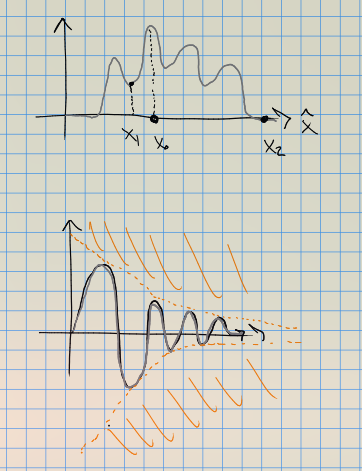
:::

:::{.corollary title="Double angle identities"}
Taking $\theta = \psi$ is the above identities yields
\[
\sin(2\theta ) 
&= \sin(\theta) \cos(\theta) + \cos(\theta) \sin(\theta) \\
&= 2\sin(\theta)\cos(\theta) \\ \\
\cos(2\theta) 
&= \cos(\theta) \cos(\theta) + \sin(\theta) \sin(\theta) \\
&= \cos^2(\theta) - \sin^2(\theta) 
.\]

:::

:::{.warnings}
The latter is not equal to 1!
That would be $\cos^2(\theta) + \sin^2(\theta)$.
:::

:::{.remark}
Why do we care? 
We had 16 special angles, this gives a lot more.
For example, 
\[
\cos(\pi/12)
=
\cos(\pi/3 - \pi/4) = \cdots \text{ plug in}
.\]
By allowing increments of $\pi/12$, we have 24 total angles.
:::

:::{.corollary title="?"}
Starting from the following:
\[
\cos(2\theta) 
&= \cos^2(\theta) - \sin^2(\theta) \\
&= \cos^2(\theta) - \qty{1 - \cos^2(\theta) } \\
&= 2\cos^2(\theta) -1 && \text{using } s^2 + c^2 = 1
,\]
one can solve for
\[
\cos^2(\theta) = {1\over 2}\qty{1 + \cos(2\theta) }
.\]

Similarly
\[
\cos(2\theta) 
&= \cos^2(\theta) - \sin^2(\theta) \\
&= \qty{1 - \sin^2(\theta) } - \sin^2(\theta) \\
&= 1-2\sin^2(\theta) && \text{using } s^2 + c^2 = 1
,\]
solving yields
\[
\sin^2(\theta) = {1\over 2} (1 - \cos(2\theta) )
.\]

:::

## Bonus: Complex Exponentials

:::{.remark}
Components of vectors: every $\vector v\in \RR^2$ breaks up as the sum of two vectors, i.e. $\vector v = \vector v_x + \vector v_y$.
:::

:::{.remark}
We've worked with the *Cartesian plane* all semester.
One powerful tool is replacing this with the *complex* plane.
We formally define a new symbol $i$ such that $i^2 = -1$, and replace the $\vhat{y}$ direction with the $i$ direction -- this amounts to replacing ordered pairs $(a, b) \da a \vhat{x} + b\vhat{y}$ by a single number $x + iy$.
:::

:::{.proposition title="Euler's Identity"}
\[
e^{i\pi} = -1
.\]

:::

:::{.remark}
The way you read this: $e^{i\theta} \in S^1$ is a complex number (identified with a vector!), and the $\theta$ tells you what direction it points in radians.
$\pi$ radians is directly to the left!
:::

