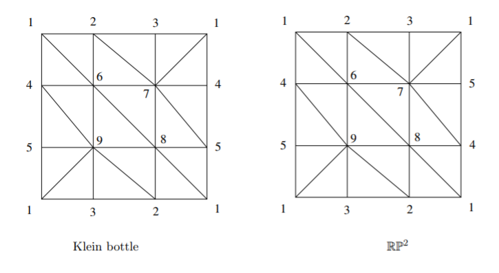

# Algebraic Topology Review Notes

## Lemma: There are no nontrivial homomorphisms from $\ZZ_n$ to $\ZZ$.

Proof: there is an element of finite order in the former, and no element of finite order in the latter. In other words, $\ZZ$ has no finite subgroups! 

This is especially useful if you have some $f: A\into B$ and you look at the induced homomorphism $f_*: \pi_1(A) \into \pi_1(B)$. If the former is finite and the latter contains a copy of $\ZZ$, then $f_*$ has to be the trivial map $f_*([\alpha]) = e \in \pi_1(B)$ for every $[\alpha] \in \pi_1(A)$.

## Definition: Homotopy

Let $X, Y$ be topological spaces and $f,g: X \to Y$ continuous maps. Then a *homotopy* from $f$ to $g$ is a continuous function 

$F: X \cross I \into Y$ 

such that 

$F(x, 0) = f(x)$ and  $F(x,1) = g(x)$ 

for all $x\in X$. If such a homotopy exists, we write $f\homotopic g$. This is an equivalence relation on $\text{Hom}(X,Y)$, and the set of such classes is denoted $[X,Y] \definedas \hom (X,Y)/\homotopic$.

## Definition: Nullhomotopic

If $f$ is homotopic to a constant map, say $f: x \mapsto y_0$ for some fixed $y_0 \in Y$, then $f$ is said to be *nullhomotopic*. In other words, if $f:X\into Y$ is nullhomotopic, then there exists a homotopy $H: X\cross I \into Y$ such that $H(x, 0) = f(x)$ and $H(x, 1) = y_0$.

Note that constant maps (or anything homotopic) induce zero homomorphisms.

# Theorem: Any two continuous functions into a convex set are homotopic.

Proof: Supposing $X$ is convex, for any two points $x,y\in X$, the line $tx + (1-t)y$ is contained in $X$ for every $t\in[0,1]$. 
So let $f, g: Z \into X$ be any continuous functions into $X$. Then define $H: Z \cross I \into X$ by $H(z,t) = tf(z) + (1-t)g(z)$, the linear homotopy between $f,g$. By convexity, the image is contained in $X$ for every $t,z$, so this is a homotopy between $f,g$.

## Definition: Homotopy Equivalence

Let $f: X \to Y$ be a continuous map, then $f$ is said to be a *homotopy equivalence* if there exists a continuous map $g: X \to Y$ such that

$$ f\circ g \homotopic \id_Y$$ and $g\circ f \homotopic \id_X$.

Such a map $g$ is called a homotopy inverse of $f$, the pair of maps is a homotopy equivalence.

If such an $f$ exists, we write $X \homotopic Y$ and say $X$ and $Y$ have the same homotopy type, or that they are homotopy equivalent. 

(Note that homotopy equivalence is strictly weaker than homeomorphic equivalence, i.e., $X\cong Y$ implies $X \homotopic Y$ but not necessarily the converse.)

## Definition: Contractible

A topological space $X$ is *contractible* if $X$ is homotopy equivalent to a point, i.e. $X \homotopic \theset{x_0}$. This means that there exists a pair of homotopy inverses $f: X \into \theset{x_0}$ and $g:\theset{x_0} \into X$ such that $f\circ g = \id_{\theset{x_0}}$ and $g\circ f = \id_X$.

This is a useful property, because it supplies you with a homotopy.

# Definition: Deformation Retract

Let $X$ be a topological space and $A \subset X$ be a subspace, then a *retraction* of $X$ onto $A$ is a map $r: X\into X$ such that the image of $X$ is $A$ and $r$ restricted to $A$ is the identity map on $A$.

Note that this definition isn't very useful, as every space has at least one retraction - for example, the constant map $r:X \into \theset{x_0}$ for any $x\_0 \in X$.

A *deformation retract* is a homotopy $H:X\cross I \into X$ from the identity on $X$ to the identity on $A$ that fixes $A$ at all times. That is, $H(x, 0) = \id_X(x) = x$, $H(x,1) \in A$, and $H(a, t) \in A$ for all $a\in A$ (so $\restrictionof{H}{A} = \id_A$).

A deformation retract between a space and a subspace is a homotopy equivalence, and further $X\homotopic Y$ iff there is a $Z$ such that both $X$ and $Y$ are deformation retracts of $Z$. Moreover, if $A$ and $B$ both have deformation retracts onto a common space $X$, then $A \homotopic B$.

## Definition: The Fundamental Group $\pi_1(X)$

Given a pointed space $(X,x_0)$, we define the fundamental group $\pi_1(X)$ as follows:

- Take the set $L = \theset{\alpha: S^1\into X \mid \alpha(0) = \alpha(1) = x_0}$.
- Define an equivalence relation $\alpha \sim \beta$ iff there exists a homotopy $H: S^1 \cross I \into X$ such that $H(s, 0) = \alpha(s)$ and $H(s, 1) = \beta(s)$, i.e. if $f\homotopic g$ in $X$.
  - Symmetric:
  - Reflexive:
  - Transitive:
- Define $L/\sim$, which contains elements like $[\alpha]$ and $[\id_{x_0}]$, the equivalence classes of loops after quotienting by this relation.
- Define a product structure: for $[\alpha], [\beta] \in L/\sim$, define $[\alpha][\beta] = [\alpha \cdot \beta]$, where we just need to define a product structure on bona fide loops. Just do this by reparameterizing:
  $(f\cdot g)(s) = \mathbb{1}[s \in \left[0, \frac{1}{2}]\right]f(2s) + \mathbb{1}[s \in \left[\frac{1}{2}, 1]\right]g(2s-1)$
  - Continuous: by the pasting lemma and assumed continuity of $f, g$
  - Well-defined:
- Check that this is actually a group
  - Identity element:
  - Closure:
  - Associativity:
  - Inverses:
- Summary: 
  - Elements of the fundamental group are *homotopy classes of loops*.
  - Continuous maps between spaces induce *some* homomorphism on fundamental groups.
    - Inclusions

# Theorem: $X$ is simply connected $\iff$ $\pi_1(X) = 0$

By definition, $X$ is simply connected iff $X$ is path connected and every loop contracts to a point.

$\Rightarrow$ Suppose $X$ is simply connected. Then every loop in $X$ contracts to a point, so if $\alpha$ is a loop in $X$, $[\alpha] = [\id_{x_0}]$, the identity element of $\pi_1(X)$. But then there is only one element in in this group.

$\Leftarrow$: Suppose $\pi_1(X) = 0$. Then there is just one element in the fundamental group, the identity element, so if $\alpha$ is a loop in $X$ then $[\alpha] = [\id_{x_0}]$. So there is a homotopy taking $\alpha$ to the constant map, which is a contraction of $\alpha$ to a point.

## Definition: Covering Maps

A covering map of a space is a map $p: \tilde X \into X$ such that each open set $U\in X$ pulls back to a disjoint union of open sets (called sheets) in $\tilde X$ (referred to as the covering space). That is, $p^{-1}(U) = \coprod_i V_i \subseteq \tilde X$. 

If $\tilde X$is simply connected, it is the universal covering space - that is, for any other covering space $Y$ of $X$, $\tilde X$ is also a cover of $Y$. We also have $\text{Aut}(\tilde X) \cong \pi_1(X)$ for universal covers - for other covers, $\text{Aut}(\tilde X) \cong N(\Gamma) / \Gamma$ where $N(\cdot)$ is the normalizer and $\Gamma$ is the set of homotopy classes of loops in $\tilde X$ that are lifted from loops in $X$.

Covering spaces of $X$ are in (contravariant) galois correspondence with subgroups of $\pi_1(X)$, i.e. the covering map induces an injective map on fundamental groups.

The number of sheets of a covering space is equal to $[p^*(\pi_1(\tilde X)): \pi_1(X)]$.

### Example: Covering spaces

Identify $S^1 \subset \CC$, then every map $p_n: S^1 \into S^1$ given by $z\mapsto z^n$ a yields a covering space $\tilde X_n$.
Note the induced map $p_n^*: \pi_1(S^1) \into \pi_1(S^1)$ is given by $[\omega_1] \mapsto [\omega_n] = n[\omega_1]$ and so $p_n^*(\pi_1(S^1)) = \ZZ_n = \text{Aut}(\tilde X_n)$. (This can also be seen the other way, by looking at deck transformations which are rotations of the circle by $2\pi/n$)

The universal cover of $S^1$ is $\RR$; this is an infinitely sheeted cover. The fiber above $x_0$ is equal to $\ZZ$.

The universal cover of $\RP^n$ is $S^n$; this is a two-sheeted cover. The fiber above $x_0$ contains the two antipodal points.

The universal cover of $T = S^1 \cross S^1$ is $\tilde X =\RR \cross \RR$. The fiber above the base point contains every point on the integer lattice $\ZZ \cross \ZZ = \pi_1(T) = \text{Aut}(\tilde X)$

## Theorem: Homotopy Lifting

The setup: given $p: \tilde X \surjective X$ a covering space of $X$, a map $f: Y \into X$, and a homotopy $H: Y\cross I \into X$ such that $f_0 \definedas H(y, 0)$ has a lift $\tilde f_0: Y\into \tilde X$.

Then there is a unique homotopy $\tilde H: Y \cross I \into \tilde X$ satisfying $p\circ \tilde H = H$
In other words, if the $t=0$ portion of a homotopy can be lifted to a cover, the entire homotopy can.

## Theorem: Lifting Criterion

Let $p:\tilde X \surjective X$ be a covering of $X$, and let $f:Y \into X$ be a map. Then there is an induced homomorphism $f^*: \pi_1(Y) \into \pi_1(X)$. There is also an induced map $p^*: \pi_1(\tilde X) \into \pi_1(X)$. We then have the following condition:

There exists a lift $\tilde f: Y \into \tilde X$ satisfying $p\circ\tilde f = f$ iff $f^*(\pi_1(Y)) \subseteq p^*(\pi_1(\tilde X))$, i.e. when the fundamental group of $Y$ injects into the projected fundamental group of the cover.

Note that if $Y$ is simply connected, then $\pi_1(Y) = 0$ and this holds automatically!

Moreover, lifts are *unique* if they agree at a single point.

(Technically you need the base space to be connected and "locally pathwise connected")

## Application: Showing when there is no covering map $f: X \into Y$

This can be done by lifting $f$ to $\tilde f: X \into \tilde Y$, the universal cover. If the covering space happens to be contractible, you get that $\tilde f$ is nullhomotopic. So there is a homotopy $\tilde H: X\cross I \into \tilde Y$ - but then $p\circ\tilde H: X \into Y$ descends to a homotopy of $f$. If you leave $f$ arbitrary, this would force $\pi_1(Y) = 0$.

## Theorem: If $Y$ is contractible, every map $f: X \into Y$ is nullhomotopic.

If $Y$ is contractible, then $Y$ has the homotopy type of a point. So there is a homotopy $H: Y\cross I \into Y$ between $\id_Y$ and a constant map $c: y \mapsto y_0$. So construct $H': X\cross I \into Y$ as $H'(x, t) = H(f(x), t)$; then $H'(x, 0) = H(f(x), 0) = (\id_x \circ f)(x) = f(x)$ and $H'(x, 1) = H(f(x), 1) = (c \circ f)(x) = c(y) = y_0$ for some $y$. So $H'$ is a homotopy between $f$ and a constant map, and $f$ is nullhomotopic.

## Theorem: Any map that factors through a contractible space is nullhomotopic.

Suppose we have the following commutative diagram:

Then $f = p \circ \tilde f$. Every map into a contractible space is nullhomotopic, so if $Z$ is contractible, then there is a homotopy $\tilde H: X\cross I \into Z$ from $\tilde f$ to a constant map $c$. But then $p\circ \tilde H: X \cross I \into Y$ is also a homotopy from $f$ to the constant map $p\circ c$.

# Definition: Monodromy Action

Given $X $ connected and locally connected, $p:\tilde X \to X$ a covering, and $\alpha$ a loop at $x\in X$, let $\tilde \alpha$ be its lift and $\tilde x\in p^{-1}(x)$ be the lifted point in the fiber above $x$. Then $\alpha$ acts on $\tilde x$ from the right, by the rule $\tilde x \curvearrowleft \alpha = \tilde\alpha(1)$.

Then $\text{stab}(\tilde x) = p_*(\pi_1(\tilde X, \tilde x)) \subseteq \pi_1(X, x)$, and this induces a homomorphism $\pi_1(X, x) \into \text{Aut}(p^{-1}(x))$ which is a permutation of elements in the fiber above $x$.

## Theorem: $\pi_1(S^1) = \mathbb{Z}$

- Build reverse map
- Use $\mathbb{R}$ as a cover of $S^1$
- Show it's a homomorphism
- Show it's injective
- Show it's surjective

## Definition: Freely and Properly Discontinuous Group Actions

## Theorem: If $G$ induces a free and properly discontinuous group action on $X$, then $p: X \rightarrow X/G$ is a covering space

Here $X/G$ denotes $X/\sim$  where $\forall x,y\in X, x\sim y \iff \exists g\in G \mid g.x = y$, i.e. all elements in a single orbit are identified.

### Proof:

Construct a map $\phi: G \rightarrow \pi_1(X/G, G.x_0)$ by $g \mapsto [p \circ \gamma_g]$ 

where $\gamma_g(0) = x_0$ and $\gamma_g(1) = G.x_0$.

- This is homomorphism:
- This is well-defined:

## Theorem: $\pi_1(\mathbb{RP}^n) \cong \mathbb{Z}_2$

## Definition: Coproduct

## Definition: Pushout

## Definition: Colimit

## Definition: Free Product with Amalgamation

## Theorem: Van Kampen's Theorem

Claim: If $X = U \cup V$, then $\pi_1(X) = \pi_1(U) \ast \pi_1(V)$.

### Proof

- Construct a map going backwards
- Show it is surjective
  - "There and back" paths
- Show it is injective
  - Divide $I\times I$ into a grid

## Definition: CW Complex

### Examples

- $\mathbb{RP}^n = e^1 \cup e^2 \cup \cdots \cup e^n$
- $\mathbb{CP}^n =e^2 \cup e^4 \cup \cdots e^{2n}$
- $S^\infty = \varinjlim S^n$

# Definition: The Degree of  Map $S^n \into S^n$

Given any $f: S^n \into S^n$, there are induced maps on homotopy and homology groups. Taking $f^*: H_n(S^n) \into H^n(S^n)$ and identifying $H^n(S^n) \cong \ZZ$, we have $f^*: \ZZ \into \ZZ$. But homomorphisms of this type are entirely determined by their action on generators. So if $f^*(1) = n$, define $n$ to be the degree of $f$.

Properties and examples:

- $\text{deg}~\id_{S^n} = 1$
- $\text{deg} (f\circ g) = \text{deg}~f \cdot \text{deg}~g$
- $\text{deg}~r = -1$ where $r$ is any rotation about a hyperplane, i.e. $r(\thevector{x_1 \cdots x_i \cdots x_n}) = \thevector{x_1 \cdots -x_i \cdots x_n}$.
- The antipodal map on $S^n\subset \RR^{n+1}$ is the composition of $n+1$ reflections, so $\text{deg}~\alpha = (-1)^{n+1}$.
- ​

# Definition: Simplicial Complex

Given a simplex $\sigma = [v_1 \cdots v_n]$, define the face map $\del_i:\Delta^n \into \Delta^{n-1}$, where $\del_i\sigma = [v_1 \cdots \hat v_i \cdots v_n]$.

A simplicial complex is a set $K​$ satisfying 

1. $\sigma \in K \implies \del_i\sigma \in K$
2. $\sigma,\tau\in K \implies \sigma\intersect\tau = \emptyset,~ \del_i\sigma,~\text{or}~\del_i\tau$
   1. This amounts to saying that any collection of $(n-1)$-simplices uniquely determines an $n$-simplex (or its lack thereof), or that that map $\Delta^k \into X$ is a continuous injection from the standard simplex in $\RR^n$.
3. $\abs{K\intersect B_\varepsilon(\sigma)} < \infty$ for every $\sigma\in K$, identifying $\sigma \subseteq \RR^n$.

To write down a simplicial complex, label the vertices with increasing integers. Then each $n$-cell will correspond to a set of $n+1$ of these integers - throw them in a list.

## Examples of Simplicial Complexes

For counterexamples, note that this fails to be a triangulation of $T$:

This fails, for example, the simplex $[1,2,1]$ does not uniquely determine a triangle in this picture.

## Templates for Triangulation

You can always triangulate a space by triangulating something homeomorphic, so for common spaces you can work with these fundamental domains:

## Mayer-Vietoris

Given $A,B \subset X$ such that $A^\circ \cup B^\circ = X$, there is a long exact sequence in homology:

$$ \cdots H^{n+1}(X) \xrightarrow{\delta} H^n(A \cap B) \xrightarrow{(i^*,~ j^*)} H^n(A) \oplus H^n(B) \xrightarrow{l^* - r^*}   H^n(X) \xrightarrow{\delta} H^{n-1}(A\cap B)\cdots$$

Where

$i: A\cap B \hookrightarrow A$

$j: A\cap B \hookrightarrow B$

$l: A \hookrightarrow X$

$r: B \hookrightarrow X$

And the stars denote the induced maps on homology.

The connecting homomorphism $\delta:H^n(X) \to H^{n-1}(X)$ is defined by taking a class $[\alpha] \in H^n(X)$, writing it as an $n$-cycle $z$, then decomposing $z = \sum c_i$ where each $c_i$ is an $x+y$ chain. Then $\del(c_i) = \del(x+y) = 0$, since the boundary of a cycle is zero, so $\del(x) = -\del(y)$. So then just define $\delta([\alpha]) = [\del x] = [-\del y]$.

### Useful Properties of Exact Sequences

1. $0 \to A \xrightarrow{\del} B \to 0$ iff $\del:A \to B$ is an isomorphism.
2. $0 \to A \xrightarrow{\del} B$ iff $\del$ is an injection.
3. $A \xrightarrow{\del} B \to 0$ iff $\del$ is a surjection.
4. $0 \to A \xrightarrow{f} B \xrightarrow{g} C \to 0$ iff $\ker g = \im f$ and $C \cong B/\im f$

### Example: $H^i(S^n) \cong H^{i-1}(S^{n-1})$.

Write $X = A \cup B$, the northern and southern hemispheres, so that $A \cap B = S^{n-1}$, the equator. In the LES, we have:

$H^{i+1}(S^n) \xrightarrow{} H^i(S^{n-1}) \xrightarrow{} H^iA \oplus H^i B \xrightarrow{} H^i S^n \xrightarrow{} H^{i-1}(S^{n-1}) \xrightarrow{} H^{i-1}A \oplus H^{i-1}B$

But $A, B$ are contractible, so $H^iA= H^iB = 0$, so we have

$H^{i+1}(S^n) \xrightarrow{} H^{i}(S^{n-1}) \xrightarrow{} 0 \oplus 0 \xrightarrow{}H^i(S^n) \xrightarrow{} H^{i-1}(S^{n-1}) \xrightarrow{} 0$

And in particular, we have the shape $0 \to A \to B \to 0​$ in an exact sequence, which is always an isomorphism.