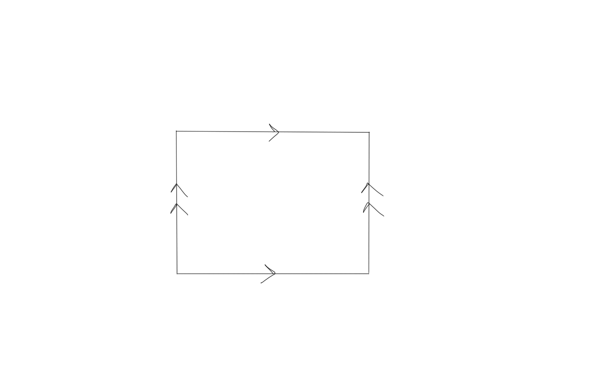
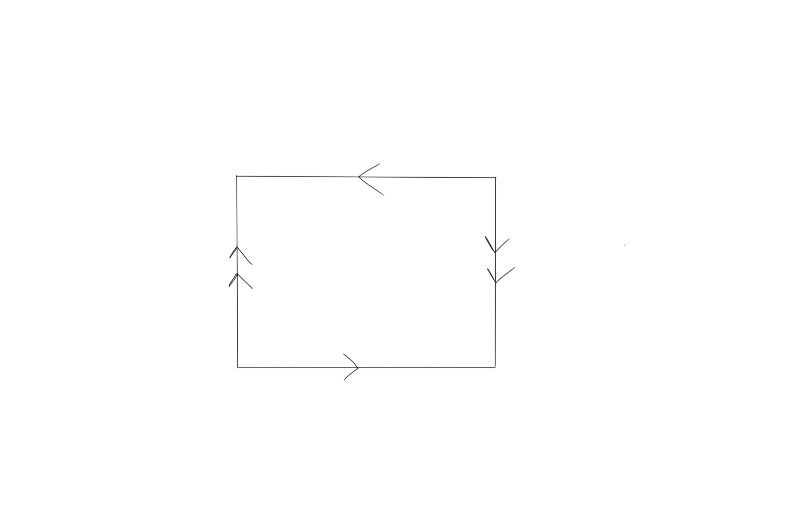
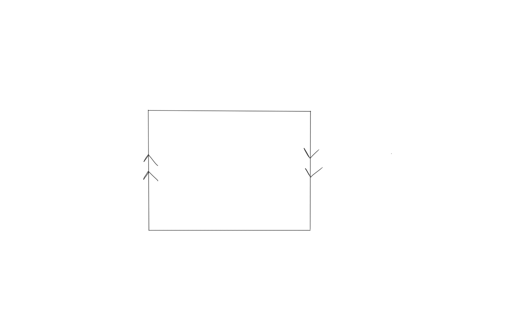

# Homotopy
- $f\homotopic g \implies f_* = g_*$ in homology.

# The Universal Coefficient Theorems
For changing coefficients from $\ZZ$ to $G$. Formulas:
$$
0 \to H_i X \tensor G \to H_i(X; G) \to \tor(H_{i-1}X, G) \to 0\\
0 \to \ext (H_{i-1} X, G) \to H^i(X;G) \to \hom(H_i X, G) \to 0
$$

- Splits unnaturally:
$$
H_i(X;G) = (H_iX\tensor G) \oplus \tor(H_{i-1}X; G)\\
H^i(X; G) = \hom(H_iX, G) \oplus \ext(H_{i-1}X; G)
$$

- When $H_iX$ are all finitely generated, write $H_i(X; \ZZ) = \ZZ^{\beta_i} \oplus T_i$. Then
$$
H^i(X; \ZZ) = \ZZ^{\beta_i} \oplus T_{i-1}
$$

# The Kunneth Formula
$$
0 \to \bigoplus_j H_j(X; R) \tensor_R H_{i-j}(Y; R) \to H_i(X\cross Y; R) \to \bigoplus_j \tor_1^R(H_j(X; R), H_{i-j-1}(Y; R))
$$

-----
# Algebra
- $\QQ \tensor A \cong S^{-1}A$ for $S = \ZZ - \theset{0}$

## Free Resolutions
- $0 \to \ZZ \mapsvia{\times m} \ZZ \mapsvia{\mod m} \ZZ_m \to 0$

## Computing Tor

$$\tor(A, B) = h[\cdots \to A_n \tensor B \to A_{n-1}\tensor B \to \cdots A_1\tensor B \to 0]$$ where $A_*$ is a free resolution of $A$.

Shorthand: $\tor: \mathcal{F}(A) \to (\wait \tensor B) \to H_*$

## Computing Ext
$$\ext(A, B) = h[\cdots \hom(A, B_n) \to \hom(A, B_{n-1}) \to \cdots \to \hom(A, B_1) \to 0 ]$$ where $B_*$ is a free resolution of $B$.

Shorthand: $\ext: \mathcal{F}(B) \to \hom(A, \wait) \to H_*$

## Properties of Tensor Product
- $(\wait) \tensor_\ZZ \ZZ = \id$
- $\ZZ_m \tensor \ZZ_n = \ZZ_d$
- $A\tensor B = 0 \implies A = 0 ~\or~ B = 0$

## Properties of Tor

- $\tor(A,B) = 0$ if $A$ or $B$ are torsion-free
- $\tor(A,B) = \tor(A_T, B_T)$ where $G_T$ is the torsion subgroup of $G$.
- $\tor(\bigoplus A_i, B) = \bigoplus \tor(A_i, B)$
- $\tor(\ZZ_n, G) = \ker (g \mapsto ng) = \theset{g\in G\mid ng = 0}$
- $\tor_0(A, B) = A \tensor B$
- $\tor(A, B) = \tor(B, A)$

## Properties of Ext

- $\ext(F, G) = 0$ if $F$ is free
- $\ext(A,B) = \ext(A_T, B_T)$ where $G_T$ is the torsion subgroup of $G$.
- $\ext(\bigoplus X_i, C) = \bigoplus \ext(X_i, C)$
- $\ext(\ZZ_n, G) \cong G/nG$
- $\ext_0(A, B) = \hom(A, B)$

## Hom/Ext/Tor Tables
$\hom$    | $\ZZ_m$  | $\ZZ$  | $\QQ$
--|---|---|--
$\ZZ_n$   | $\ZZ_d$  | $0$    | $0$  
$\ZZ$     | $\ZZ_m$  | $\ZZ$  | $\QQ$
$\QQ$     | $0$      | $0$    | $\QQ$

$\tor$    | $\ZZ_m$ | $\ZZ$ | $\QQ$
--|---|---|--
$\ZZ_n$   | $\ZZ_d$ | $0$   | $0$  
$\ZZ$     | $0$     | $0$   | $0$
$\QQ$     | $0$     | $0$   | $0$

$\ext$    | $\ZZ_m$   | $\ZZ$                 | $\QQ$
--|---|---|--
$\ZZ_n$   | $\ZZ_d$   | $\ZZ_n$               | $0$  
$\ZZ$     | $0$       | $0$                   | $0$
$\QQ$     | $0$       | $\mathcal{A_p}/\QQ$   | $0$

Things that behave like "the zero map":

- $\ext(\ZZ, \wait)$
- $\tor(\ZZ, \wait), \tor(\QQ, \wait)$
- $\tor(\wait, \ZZ), \tor(\wait, \QQ)$

Thins that behave like "the identity map":

- $\hom(\ZZ, \wait)$

For description of $\mathcal{A_p}$, see [here](http://math.jhu.edu/~jmb/note/torext.pdf).

-----

# Lefshectz Number

# Low Dimensional Homology Examples

$$
\begin{array}{}
\SS^1 &=  &[&\ZZ, &\ZZ,               &0,    &0, &0,    &0\rightarrow & ]\\
\MM   &=  &[&\ZZ, &\ZZ,               &0,    &0, &0,    &0\rightarrow & ]\\
\RP^1 &=  &[&\ZZ, &\ZZ,               &0,    &0, &0,    &0\rightarrow & ]\\
\RP^2 &=  &[&\ZZ, &\ZZ_2,             &0,    &0, &0,    &0\rightarrow & ]\\
\RP^3 &=  &[&\ZZ, &\ZZ_2,             &0,    &\ZZ, &0,    &0\rightarrow & ]\\
\RP^4 &=  &[&\ZZ, &\ZZ_2,             &0,    &\ZZ_2, &0,    &0\rightarrow & ]\\
\SS^2 &=  &[&\ZZ, &0,                 &\ZZ,  &0, &0,    &0\rightarrow & ]\\
\TT^2 &=  &[&\ZZ, &\ZZ^2,             &\ZZ,  &0, &0,    &0\rightarrow & ]\\
\KK &=    &[&\ZZ, &\ZZ \oplus \ZZ_2,  &0,    &0, &0,    &0\rightarrow & ]\\
\CP^1 &=  &[&\ZZ, &0,                 &\ZZ,  &0, &0,    &0\rightarrow & ]\\
\CP^2 &=  &[&\ZZ, &0,                 &\ZZ,  &0, &\ZZ,  &0\rightarrow & ]\\
\end{array}
$$

# Low Dimensional Equivalences
- $\RP^1 \cong \SS^1$
- $\CP^1 \cong \SS^2$
- $\MM \homotopic \SS^1$

# Homology Results
- $H_n M^n = \ZZ \iff M^n$ is orientable.
- $H_n(\bigvee_\alpha X_\alpha) = \bigoplus_\alpha H_n X_\alpha$
- $H_n(X, A) \cong H_n(X/A)$
- $H_n(X) = 0 \iff X$ has no $n\dash$cells.
- $C^0 X = \pt \implies d_1: C^1 \to C^0$ is the zero map.
- $H^*(X; \FF) = \hom(X,\FF)$ for a field.

# Long Exact Sequences
$$
\begin{align}
%
A \subseteq X \implies
&A \to X \to X/A \mapsvia{\delta} \cdots \\
%
X = A\cup B \implies
&A\cap B \to A \oplus B \to A \cup B \mapsvia{\delta} \cdots\\
%
(X,A) \implies
&A \to X \to X,A \mapsvia{\delta} \cdots\\
%
A\to B \to C \implies
& \tor(A, G) \to \tor(B, G) \to \tor(C, G) \mapsvia{\delta_\downarrow} \cdots \\
A\to B \to C \implies
& \ext(A, G) \to \ext(B, G) \to \ext(C, G) \mapsvia{\delta_\uparrow} \cdots
\end{align}
$$

# Cellular Homology
How to compute:

1. Write cellular complex $$0 \to C^n \to C^{n-1} \to \cdots C^2 \to C^1 \to C^0 \to 0$$
2. Compute differentials $\del_i: C^i \to C^{i-1}$
    1. Note - $C^0 X = \pt \implies d_1: C^1 \to C^0$ is the zero map
    2. Note - $H_n X = 0 \iff X$ has no $n\dash$cells.
    3. Compute local degrees
    3. Use $\del_n(e_i^n) = \sum_i d_i e_i^{n-1}$ where $d_i = \deg(\text{Attach }e_i^n \to \text{Collapse } X^{n-1}\dash\text{skeleton})$, which is a map $S^{n-1} \to S^{n-1}$

# Manifolds
- If $M^\text{orientable} \mapsvia{\pi_k} M^\text{non-orientable}$ is a $k\dash$fold cover, then $k$ is even or $\infty$.

# Surfaces
- Orientable:
  - $S^n, T^n, \RP^\text{odd}$
- Nonorientable:
  - $\RP^\text{even}, \mathbb{M}, \mathbb{K}$

# Pasting Diagrams

