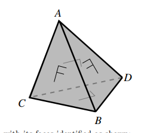
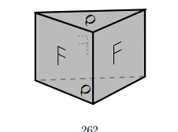

# Topology Problems Q2

# Mayer Vietoris (Sheet 7)

1. Compute the homology of:

   1. $\RP^2 = M \union_\del D^2$
   2. $T^2 = S^1 \cross S^1 = (S^1\cross I)\union_f (S^1\cross I)$
      where $(x,0) \sim (x,1) \sim (\bar x, 0) \in \CC$
   3. $S^1 \union_{f} B^2$ attached along $\del B^2$ using $z\mapsto z^n$

2. Show $\tilde H_i(\Sigma X) \cong \tilde H_{i-1}(X)$

   1. Show $\Sigma S^n \cong S^{n+1}$

3. For $f: S^n\circlearrowleft$, show $\deg f = \deg \Sigma f$

   1. Conclude $\pi_n(S^n) = \ZZ$

4. Let $\theset{A_i}^n \in \bf{Ab}$ be finitely generated, show $\exists X \mid H_i(X) \cong A_i$ for $i\leq n$ and 0 otherwise. 

5. Suppose $X = \union_i^n A_i$ such that for any $1\leq k \leq n,~ \intersect_i^k A_i$ is either empty or contractible, show $i\geq n-1 \implies \tilde H_i(X) = 0$ and that this bound is sharp.

6. Compute $H_*(X\cross S^n)$ in terms of $H_*(X)$

   1. Compute $H_*(T^n)$

7. Let $M = (S^1 \cross B^2) \union_{\id_\del} (S^1 \cross B^2)$ and compute $H_*(M; \ZZ)$

8. Let $X = S^n\cross I$ with its ends glued together by a map $S^n \circlearrowleft$ of degree $d$, calculate $H_*(X)$.

9. Compute $H_*(X)$ for $X = S^3 - N$, with $N$ a knotted solid torus and $\del N = T$ its boundary torus

10. Let $CA$ be the cone on $A$, show that $\tilde H_*(X \union CA) \cong \tilde H_*(X, A)$.

11. Show that the Mayer-Vietoris sequence is natural, i.e.
    If $X\mapsvia{f} Y$ where $f(A) \subset C$ and $f(B) \subset D$, then this commutes:
    $$
    \begin{CD}
    H_n(X) @>>> H_n(A\intersect B) @>>> H_n(A) \oplus H_n(B) @>>> H_{n-1}(X)\\
    @VVf_*V @VVf_*V  @VVf_*V @VVf_*V\\
    H_n(Y) @>>> H_n(C\intersect D) @>>> H_n(C) \oplus H_n(D) @>>> H_{n-1}(Y)\\
    \end{CD}
    $$

# Cellular Homology (Sheet 8)

Compute the homology of these spaces

1. $S_m \vee S_n$
   1. $S^m \cross S^n$
2. A hexagon with the identifications $a+b+c-a-b-c$
3. Orientable surface of genus $g$
   1. $g=2$ is given by $a+b-a-b+c+d-c-d$
4. Nonorientable surface of genus $g$
   Obtain by removing $g$ discs from $S^2$ and attaching $g$ mobius strips
5. $S_1 \vee S_1$ with two discs attached via $(ab)^3$ and $(ab)^6$
6. This identification space:
   
7. This identification space:
   
8. This identification space:
   
9. Describe a CW complex structure for the lens space $L(p, 1)$ and compute $\pi_1, H_*$ for it.

# Degree

1. Let $p(x) = \sum_i^na_ix^i$, view $p: \CC \union \infty \selfmap$ and determine its topological degree
2. Let $p(z) = \frac{\prod_i^n z-a_i}{\prod_j^m z-b_j}$ with all $a_i, b_j$ distinct. What is its topological degree?
3. Show that if $f: S^m \into S^n$ and $\exists U \subset S^m$ such that $\restrictionof{f}{U} \cong f(U)$, then $m=n$ and $f$ is surjective.

# Universal Coefficient Theorem (Sheet 10)

# Homological Algebra (Sheet 11)

1. Show that $\ker A \into A\tensor \QQ$ given by $a \mapsto a\tensor 1$ is the torsion subgroup of $A$.
2. Show that $A\injects B \implies A\tensor \QQ \injects B\tensor \QQ$
3. Find a free resolution of $\QQ$ as a $\ZZ$-module.
4. Compute $\tor(\QQ, A)$
   1. Compute $\tor(\QQ/\ZZ, A)$
5. ​
6. Let $R = \ZZ[x,y]$, and $M = R/(x-y), N = R/(x,y)$. Construct free resolutions of $M,N$ to compute:
   - $\ext_R^*(M, M)$
   - $\ext_R^*(M, N)$
   - $\ext_R^*(N, M)$
   - $\ext_R^*(N, N)$
7. Let $\Lambda_*$ be the exterior algebra generated by the symbols $\theset{dx_i}^n$ over a field $k$. Show that letting $d  = \cdot \vee dx_1$ yields a chain complex
   $0 \into \Lambda^0 \into \Lambda^1 \into \cdots \into \Lambda^n \into 0$
   with trivial homology. Compute what happens when $dx_1$ is replaced with an arbitrary non-zero element in $\Lambda^1$.
8. Define $M$ as the group ring $R = \ZZ[\ZZ_2]$ with the action $(\cdot) \times -1$. Construct a free resolution of $M$ and compute $\tor_R^*(M, M)$.
9. Show $\tor_R^*(\cdot, \cdot)$ is symmetric in the following way:
   Given $M, N$, take free resolutions, view $M_* \into M$ as a chain map and tensor with $N_*$ to get a chain map$\psi: M_* \tensor_R N_* \into M \tensor_R N_*$. Show that $\psi$ is a quasi-isomorphism using the exact sequence
   $0 \into (Z_n, 0) \into (N_n, 0) \into (B_{n-1}, 0) \into 0$, then switch the roles of $M, N$.
10. Prove that for a SES $0\into A\into B\into C$, the group $\ext(C,A)$ classifies extensions of $C$ by $A$ up to isomorphism.

# Cohomology Ring (Sheet 12)

1. ​